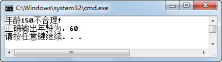

## 1.8  自定义异常类


&emsp;&emsp;自定义异常，顾名思义，就是程序员自己定义的异常。当Java类库中的异常不能满足程序需求时，程序员可以自己定义并使用异常。下面结合一个实际的例子，介绍如何定义并使用自定义异常。

### 1.8.1  自定义异常类定义  

&emsp;&emsp;Exception类是Java中所有异常类的父类，所以定义自定义异常类时，通常继承自该类。现在定义一个自定义异常类AgeException，它有一个构造函数和一个toString()方法，具体代码如下：


```
//自定义异常类，处理年龄大于120或小于0的Person

class AgeException extends Exception{

    private String message;

    public AgeException(int age)                  //自定义异常类构造方法

    {

        message = "年龄设置为：" + age + "不合理!";

    }

    public String toString()                           //自定义异常类toString()方法

    {

        return message;

    }

}
```
### 1.8.2  自定义异常类使用  

&emsp;&emsp;接下来通过Person类和TestEx19这两个类，来使用这个自定义异常类。具体代码如下（其中注释简要说明了重要步骤的含义）：


```
class Person{

    private int age;

    //声明setAge(int age)方法可能抛出AgeException自定义异常

    public void setAge(int age) throws AgeException 

    {

        if(age <=0 || age >= 120){

            throw new AgeException(age);//抛出AgeException自定义异常

        }else{

            this.age = age;

        }

    }

    public int getAge(){

        return age;

    }

}

public class TestEx19{

    public static void main(String[] args) 

    {

        Person p1 = new Person();

        Person p2 = new Person();

        try {

            p1.setAge(150);                    //会抛出AgeException自定义异常

            System.out.println("正确输出年龄为：" + p1.getAge());

        } catch (AgeException e) {            //进行异常捕获处理

            System.out.println(e.toString());

        }

        try {

            p2.setAge(60);                      //不会抛出AgeException自定义异常

            System.out.println("正确输出年龄为：" + p2.getAge());

        } catch (AgeException e1) {

            System.out.println(e1.toString());

        }

    }

}
```


程序运行结果如图1.22所示。


<p align="center"></p>   
<p align="center">图1.22  自定义异常类使用</p>   


