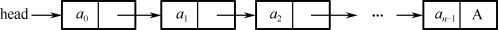

## 2.2  数据存储结构
 

&emsp;&emsp;数据的存储结构是指数据的逻辑结构在计算机中的表示，即在计算机中如何进行物理存储。数据存储结构通常分为两类：顺序存储结构和链式存储结构。

&emsp;&emsp;顺序存储结构是把逻辑上相邻的节点存储在物理位置相邻的存储单元里，节点间的逻辑关系由存储单元的邻接关系来体现，由此得到的存储表示称为顺序存储结构。顺序存储结构是一种最基本的存储表示方法，通常借助于程序设计语言中的数组来实现。

&emsp;&emsp;链式存储结构不要求逻辑上相邻的节点在物理位置上也相邻，节点间的逻辑关系是由附加的指针字段表示的，由此得到的存储表示称为链式存储结构。链式存储结构通常借助于程序设计语言中的指针/引用类型来实现。

### 2.2.1  顺序存储结构  

&emsp;&emsp;在计算机中用一组地址连续的存储单元依次存储数据逻辑结构的各个数据元素，称作顺序存储结构。　

&emsp;&emsp;顺序存储结构是存储结构类型中的一种。顺序存储结构的主要优点有两个，一是节省存储空间，因为分配的存储单元全用来存放节点的数据，节点之间的逻辑关系没有占用额外的存储空间；二是增加了访问速度，因为采用这种方式，可实现对节点的随机存取，即每个节点对应一个序号，由该序号可以直接计算节点的存储地址。

&emsp;&emsp;顺序存储结构的主要缺点是插入、删除元素时速度较慢。因为对节点进行插入、删除操作时，需要向后或向前移动一系列的节点，比较消耗系统资源。顺序存储结构如图2.6所示。

  

图2.6  顺序存储结构示意图
  

### 2.2.2  链式存储结构  

&emsp;&emsp;链式存储结构是在计算机中，用一组任意的存储单元，存储数据逻辑结构的数据元素。链式存储结构不要求逻辑上相邻的元素在物理位置上也相邻，而是通过指针来实现数据逻辑结构数据元素之间的相邻关系。可以说，链式存储结构和顺序存储结构的优缺点正好相反，下面是对链式存储结构特点的总结。  

&emsp;&emsp;（1）链式存储结构每个节点是由数据域和指针域组成的。  

&emsp;&emsp;（2）链式存储结构比顺序存储结构空间占用大，因为每个节点都由数据域和指针域组成，所以相同空间内假设全存满的话，顺序存储结构比链式存储结构存储数据更多。  

&emsp;&emsp;（3）链式存储结构插入、删除灵活，不必移动节点，只要改变节点中的指针即可。  

&emsp;&emsp;（4）链式存储结构查找节点时要比顺序存储结构速度慢，因为要通过指针逐个查找。  

&emsp;&emsp;链式存储结构如图2.7所示。  

  

图2.7  链式存储结构示意图
  

 

 
