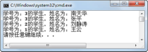
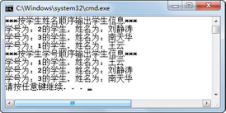

## 3.5  工具类

&emsp;&emsp;本节将介绍两个工具类的使用，这两个工具类的特点是类中的方法都是静态的，不需要创建对象，直接使用类名调用即可。

&emsp;&emsp;Collections工具类，是集合对象的工具类，提供了操作集合的工具方法，例如排序、复制和反转排序等方法。

&emsp;&emsp;Arrays工具类，是数组的工具类，提供了对数组的工具方法，例如排序、二分查找等。

### 3.5.1  Collections工具类常用方法  

- void sort(List list)

&emsp;&emsp;根据数据元素的自然顺序对指定集合按升序进行排序。

- void sort(List list, Comparator c)

&emsp;&emsp;根据指定比较器产生的顺序对指定集合进行排序。通过自定义Comparator比较器，可以实现按程序员定义的规则进行排序。Collections工具类里很多方法都可以指定比较器进行比较和排序，这里不都列举出来。关于Comparator比较器，将会在下面的课程中介绍。

- void shuffle(List list)

&emsp;&emsp;对指定集合进行随机排序。

- void reverse(List list)

&emsp;&emsp;反转指定集合中数据元素的顺序。

- Object max(Collection coll)

&emsp;&emsp;根据数据元素的自然顺序，返回给定Collection集合中的最大元素。该方法的输入类型为Collection接口，而非List接口，因为求集合中最大元素不需要集合是有序的。在Collections工具类里静态方法中输入参数的类型，需要大家注意区分。

- Object min(Collection coll)

&emsp;&emsp;根据数据元素的自然顺序，返回给定Collection的最小元素。

- int binarySearch(List list,Object o)

&emsp;&emsp;使用二分查找法查找指定集合，以获得指定数据元素的索引。如果此集合中不包含该数据元素，则返回-1。在进行此调用之前，必须根据集合数据元素的自然顺序对集合进行升序排序（通过 sort(List list)方法）。如果没有对集合进行排序，则结果是不确定的。如果集合中包含多个元素等于指定的数据元素，则无法保证找到的是哪一个。

- int indexOfSubList(List source,List target)

&emsp;&emsp;返回指定源集合中第一次出现指定目标集合的起始位置，如果没有出现这样的集合，则返回-1。

- int lastIndexOfSubList(List source,List target)

&emsp;&emsp;返回指定源集合中最后一次出现指定目标集合的起始位置，如果没有出现这样的集合，则返回-1。

 

- void copy(List dest,List src)

&emsp;&emsp;将所有数据元素从一个集合复制到另一个集合。

- void fill(List list,Object o)

&emsp;&emsp;使用指定数据元素替换指定集合中的所有数据元素。

- boolean replaceAll(List list,Object old,Object new)

&emsp;&emsp;使用一个指定的新数据元素替换集合中出现的所有指定的原数据元素。

- void swap(List list,int i,int j)

&emsp;&emsp;在指定集合的指定位置处交换数据元素。

### 3.5.2  Collections工具类使用  

&emsp;&emsp;接下来通过一个例子来演示Collections工具类中静态方法的使用。


```
import java.util.*;

public class TestCollections

{

public static void main(String[] args) 

​         {

List list = new ArrayList();

​                  list.add("w");

​                  list.add("o");

​                  list.add("r");

​                  list.add("l");

​                  list.add("d");                 

​                  System.out.println("排序前：                " + list);

​                  System.out.println("该集合中的最大值：" + Collections.max(list));   

​                  System.out.println("该集合中的最小值：" + Collections.min(list));

​                  Collections.sort(list);

​                  System.out.println("sort排序后：            " + list);

​                  //使用二分查找，查找前须保证被查找集合是自然有序排列的

​                  System.out.println("r在集合中的索引为： " + Collections.binarySearch(list,"r"));       

​                  Collections.shuffle(list);                  

​                  System.out.println("再shuffle排序后：       " + list);

​                  Collections.reverse(list);                 

​                  System.out.println("再reverse排序后：       " + list);

​                  Collections.swap(list,1,4);              

​                  System.out.println("索引为1、4的元素交换后：" + list);

​                  Collections.replaceAll(list,"w","d");                  

​                  System.out.println("把w都换成d后的结果：    " + list);

​                  Collections.fill(list,"s");                  

​                  System.out.println("全部填充为s后的结果：   " + list);

​         }

}

```

 

&emsp;&emsp;编译、运行程序，运行结果如图3.5所示。


<p align="center"></p>  
<p align="center">图3.5  Collections工具类使用</p>  


### 3.5.3  Comparable与Comparator  

&emsp;&emsp;之前我们使用了Comparable接口实现了在TreeSet集合中的自定义排序。这种方法是通过在集合内的元素类中，实现compareTo(Object o)方法进行元素和元素之间的比较、排序的。因为是在类内部实现比较，所以可以将Comparable称为内部比较器。

&emsp;&emsp;由实现了Comparable接口的类组成的集合，可使用Collections工具类的sort(List list)方法进行排序，排序规则是由compareTo(Object o)方法确定的。TreeSet集合是一个有序的Set集合，默认即按照Comparable接口的排序规则进行排序。而其他List集合，默认是按照用户添加元素的顺序进行排序的，要想让集合元素按照Comparable接口的排序规则进行排序，需要使用Collections工具类的sort(List list)方法。String、Integer等一些类已经实现了Comparable接口，所以将这些类加入List集合中，就可以直接进行排序了。

&emsp;&emsp;接下来通过一个案例来说明Collections工具类的sort(List list)方法对集合内元素实现Comparable接口的依赖，具体代码如下：


```
import java.util.*;

public class TestComparable

{

​         public static void main(String[] args) 

​         {

//用LinkedList存储学生对象

​                  LinkedList stuLL = new LinkedList();

​                  stuLL.add(new Student("王云",1));

​                  stuLL.add(new Student("南天华",3));     

​                  stuLL.add(new Student("刘静涛",2));

​                  stuLL.add(new Student("张平",3));

​                  //使用sort方法进行排序

​                  Collections.sort(stuLL);

​                  Iterator it = stuLL.iterator();

​                  while (it.hasNext()) {

​                           System.out.println(it.next());

​                  }

​         }

}

class Student{

​         int stuNum = -1;

​         String stuName = "";

​         Student(String name, int num) {

​                  this.stuNum = num;

​                  this.stuName = name;

​         }

​         public String toString() {

​                  return "学号为：" + stuNum + "的学生，姓名为：" + stuName;

​         }

}
```


&emsp;&emsp;编译、运行，程序运行时抛出异常，提示Student类没有实现Comparable接口，无法进行排序。修改上面的Student类，实现Comparable接口的compareTo(Object o)方法，具体代码如下：


```
//按学号进行降序排序，学号相同按姓名排序

class Student implements Comparable{

​         //省略其他代码

​         //实现Comparable接口的compareTo(Object o)方法

​         public int compareTo(Object o) {

Student input = (Student) o;

​                  int res = stuNum < input.stuNum ? 1 : (stuNum == input.stuNum ? 0 : -1);

​                  if (res == 0) {

res = stuName.compareTo(input.stuName);

​                  }

​                  return res;

​         }

}

```

&emsp;&emsp;再次编译、运行程序，运行结果如图3.9所示。


<p align="center"></p>  
<p align="center">图3.9  Comparable比较器的使用</p>  


&emsp;&emsp;既然将Comparable称为内部比较器，那么自然就会想到应该有外部比较器。接下来要隆重推出的就是Comparator外部比较器，也就是在学习Collections工具类的sort(List list, Comparator c)方法时提到的比较器。

&emsp;&emsp;Comparator可以理解为一个专用的比较器，当集合中的对象不支持自比较或者自比较的功能不能满足程序员的需求时，可以写一个比较器来完成两个对象之间的比较，从而实现按比较器规则进行排序的功能。

&emsp;&emsp;接下来，通过在外部定义一个姓名比较器和一个学号比较器，然后在使用Collections工具类的sort（List list，Comparator c）方法时选择使用其中一种外部比较器，对集合里的学生信息按姓名、学号分别排序输出，具体代码如下：


```
import java.util.*;

//定义一个姓名比较器

class NameComparator implements Comparator {

//实现Comparator接口的compare()方法

​         public int compare(Object op1, Object op2) {

Student eOp1 = (Student)op1;

​                  Student eOp2 = (Student)op2; 

​                  //通过调用String类compareTo()方法进行比较

​                  return eOp1.stuName.compareTo(eOp2.stuName);

​         }

} 

//定义一个学号比较器

class NumComparator implements Comparator {

​         //实现Comparator接口的compare方法

​         public int compare(Object op1, Object op2) {

​                  Student eOp1 = (Student)op1;

​                  Student eOp2 = (Student)op2;    

​                  return eOp1.stuNum - eOp2.stuNum;

​         }

} 

public class TestComparator

{

​         public static void main(String[] args) 

​         {

​                  //用LinkedList存储学生对象

​                  LinkedList stuLL = new LinkedList();

​                  stuLL.add(new Student("王云",1));

​                  stuLL.add(new Student("南天华",3));     

​                  stuLL.add(new Student("刘静涛",2));

​                  //使用sort方法，按姓名比较器进行排序

​                  Collections.sort(stuLL,new NameComparator());

​                  System.out.println("***按学生姓名顺序输出学生信息***");

​                  Iterator it = stuLL.iterator();

​                  while (it.hasNext()) {

​                           System.out.println(it.next());

​                  }       

​                  //使用sort方法，按学号比较器进行排序

​                  Collections.sort(stuLL,new NumComparator());

​                  System.out.println("***按学生学号顺序输出学生信息***");

​                  it = stuLL.iterator();

​                  while (it.hasNext()) {

​                           System.out.println(it.next());

​                  }       

​         }

}

//定义学生对象，未实现Comparable接口

class Student{

​         int stuNum = -1;

​         String stuName = "";

​         Student(String name, int num) {

​                  this.stuNum = num;

​                  this.stuName = name;

​         }

​         public String toString() {

​                  return "学号为：" + stuNum + "的学生，姓名为：" + stuName;

​         }

}
```


&emsp;&emsp;程序运行结果如图3.10所示。


<p align="center"></p>  
<p align="center">图3.10  Comparator比较器的使用</p>  


### 3.5.4  Arrays工具类使用  

&emsp;&emsp;Arrays类是操作数组的工具类，和Collections工具类相似，它提供的所有方法都是静态的。Arrays类主要有以下功能：

- 对数组进行排序。

- 给数组赋值。

- 比较数组中元素的值是否相当。

- 进行二分查找。

&emsp;&emsp;接下来通过一段代码，演示Arrays工具类的使用，具体代码如下：


```
import java.util.Arrays;

public class TestArrays{

​         public static void output(int[] a){

​                  for(int num:a){

​                           System.out.print(num + " ");

​                  }

​                  System.out.println();

​         }

​         public static void main(String[] args) {

​                  int[] array = new int[5];

​                  //填充数组

​                  Arrays.fill(array, 8);

​                  System.out.println("填充数组Arrays.fill(array,8)：");

​                  TestArrays.output(array);

​                  //将数组索引为1到4的元素赋值为6

​                  Arrays.fill(array, 1, 4, 6);

​                  System.out.println("将数组索引为1到4的元素赋值为6 Arrays.fill(array, 1, 4, 6)：");

​                  TestArrays.output(array);

​                  int[] array1 = {12,9,21,43,15,6,19,77,18};

​                  //对数组索引为3到7的元素进行排序

​                  System.out.println("排序前，数组的序列为：");

​                  TestArrays.output(array1);

​                  Arrays.sort(array1,3,7);

​                  System.out.println("对数组索引为3到7的元素进行排序：Arrays.sort(array1,3,7)：");

​                  TestArrays.output(array1);

​                  //对数组进行自然排序

​                  Arrays.sort(array1);

​                  System.out.println("对数组进行自然排序 Arrays.sort(array1)：");            

​                  TestArrays.output(array1);

​                  //比较数组元素是否相等

​                  int[] array2 = array1.clone();

​                  System.out.println("数组克隆后是否相等：Arrays.equals(array1, array2):" + 

​                           Arrays.equals(array1, array2));

​                  //使用二分查找法查找元素下标（数组必须是排序好的）

​                  System.out.println("77在数组中的索引：Arrays.binarySearch(array1, 77)：" 

​                           \+ Arrays.binarySearch(array1, 77));

​         }

}
```


&emsp;&emsp;编译、运行程序，其运行结果如图3.11所示。


<p align="center"></p>  
<p align="center">图3.11  Arrays工具类的使用</p>  


 
