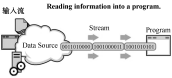
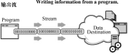

## 4.2  字节流和字符流
 

&emsp;&emsp;在正式学习字节流及字符流以前，有必要先来了解一下I/O流。

### 4.2.1  I/O流 

 

&emsp;&emsp;在Java中，文件的输入和输出是通过流（Stream）来实现的，流的概念源于UNIX中管道（pipe）的概念。在 UNIX 系统中，管道是一条不间断的字节流，用来实现程序或进程间的通信，或读写外围设备、外部文件等。

&emsp;&emsp;一个流，必有源端和目的端，它们可以是计算机内存的某些区域，也可以是磁盘文件，甚至可以是Internet上的某个URL。对于流而言，不用关心数据是如何传输的，只需要向源端输入数据，从目的端获取数据即可。

&emsp;&emsp;输入流和输出流的示意图分别如图4.5和图4.6所示。


<p align="center"></p>  
<p align="center">图4.5  输入流示意图   </p>  


<p align="center"></p>  
<p align="center">图4.6  输出流示意图</p>  


​                                         

&emsp;&emsp;如何理解输入和输出呢？简单地说，你听别人唠叨就是输入，你向别人发牢骚就是输出。在计算机的世界中，输入Input和输出Output都是针对计算机的内存而言的。比如读取一个硬盘上的文件，对于内存就是输入；向控制台打印输出一句话，就是输出。Java中对于此类输入/输出的操作统称为I/O，即Input/Output。

&emsp;&emsp;流是对I/O操作的形象描述，水从一个地方转移到另一个地方就形成了水流，而信息从一处转移到另一处就叫做I/O流。

&emsp;&emsp;输入流的抽象表示形式是接口InputStream；输出流的抽象表示形式是接口OutputStream。

&emsp;&emsp;JDK中InputStream和OutputStream的实现就抽象了各种方式向内存读取信息和向外部输出信息的过程。我们之前常用的System.out.println();就是一个典型的输出流，目的是向控制台输出信息。而new Scanner(System.in);就是一个典型的输入流，读取控制台输入的信息。System.in和System.out两个变量就是InputStream和OutputStream的实例对象。

&emsp;&emsp;流按照处理数据的单位，可以分为字节流和字符流。字节流的处理单位是字节，通常用来处理二进制文件，例如音乐、图片文件等。而字符流的处理单位是字符，因为Java采用Unicode编码，Java字符流处理的即为Unicode字符，所以在操作汉字、国际化等方面，字符流具有优势。


### 4.2.2  字节流  

&emsp;&emsp;所有的字节流类都继承自InputStream或OutputStream两个抽象类，这两个抽象类拥有的方法可以通过查阅Java API获得。JDK提供了不少字节流，下面列举了5个输入字节流类，输出字节流类和输入字节流类存在对应关系，这里不再一一列举。

- FileInputStream：把一个文件作为输入源，从本地文件系统中读取数据字节，实现对文件的读取操作。

- ByteArrayInputStream：把内存中的一个缓冲区作为输入源，从内存数组中读取数据字节。

- ObjectInputStream：对以前使用ObjectOutputStream写入的基本数据和对象进行反序列化，用于恢复那些以前序列化的对象，注意这个对象所属的类必须实现 Serializable 接口。

- PipedInputStream：实现了管道的概念，从线程管道中读取数据字节。主要在线程中使用，用于两个线程间通信。

- SequenceInputStream：表示其他输入流的逻辑串联。它从输入流的有序集合开始，并从第一个输入流开始读取，直至到达文件末尾，接着从第二个输入流读取，依次类推，直至到达包含的最后一个输入流的文件末尾为止。

- System.in：从用户控制台读取数据字节，在System类中，in是InputStream类的静态对象。

&emsp;&emsp;接下来通过一个案例来说明如何使用FileInputStream和FileOutputStream两个字节流类，实现复制文件内容的目的。


```
import java.io.*;

public class TestByteStream{

​         public static void main(String[] args) throws IOException {

​                  FileInputStream in = null;

​                  FileOutputStream out = null;

​                  try{

​                           File f = new File("C:\\com\bd\\zuche\\Vehicle1.java");

​                           f.createNewFile();

​                           //通过构造方法之一：String构造输入流

​                           in = new FileInputStream("C:\\com\\bd\\zuche\\Vehicle.java");

​                           //通过构造方法之一：File类构造输出流

​                           out = new FileOutputStream(f);

​                           //通过逐个读取、存入字节，实现文件复制

​                           int c;

​                           while ((c = in.read()) != -1) {

​                                    out.write(c);

​                           }

​                  }catch(IOException e){

​                           System.out.println(e.getMessage());

​                  }finally{

​                           if(in != null){

​                                    in.close();

​                           }

​                           if(out != null){

​                                    out.close();

​                           }

​                  }

​         }

}
```


&emsp;&emsp;上面的代码分别通过传入字符串和File类，创建了文件输入流和输出流，然后调用输入流类的read()方法从输入流读取字节，再调用输出流的write()方法写入字节，从而实现了复制文件内容的目的。

&emsp;&emsp;代码中有两个细节需要注意：一是read()方法碰到数据流末尾，返回的是-1；二是在输入、输出流用完之后，要在异常处理的finally块中关闭输入、输出流，以节省资源。

&emsp;&emsp;编译、运行程序，C:\com\bd\zuche目录下新建了一个Vehicle1.java文件，打开该文件和Vehicle.java对比，内容一致。再次运行程序，并再次打开Vehicle1.java文件，Vehicle1.java里面的原内容没有再重复增加一遍，这说明输出流的write()方法是覆盖文件内容，而不是在文件内容后面添加内容。如果想采用添加的方式，则在使用构造方法创建字节输出流时，增加第二个值为true的参数即可，例如new FileOutputStream(f,true)。

&emsp;&emsp;程序中，通过f.createNewFile();代码创建了Vehicle1.java这个文件，然后从Vehicle.java向Vehicle1.java实施内容复制。如果注释掉创建文件的这行代码（删除之前创建的Vehicle1.java文件），编译、运行程序，会自动创建出这个文件吗？请大家自己尝试！

&emsp;&emsp;接下来列举InputStream输入流的可用方法。

- int read()

&emsp;&emsp;从输入流中读取数据的下一个字节，返回0～255范围内的int型字节值。

- int read(byte[] b)

&emsp;&emsp;从输入流中读取一定数量的字节，并将其存储在字节数组b中，以整数形式返回实际读取的字节数。

- int read(byte[] b, int off, int len)

&emsp;&emsp;将输入流中最多len个数据字节读入字节数组b中，以整数形式返回实际读取的字节数，off指数组b中将写入数据的初始偏移量。

- void close()

&emsp;&emsp;关闭此输入流，并释放与该流关联的所有系统资源。

- int available()

&emsp;&emsp;返回此输入流下一个方法调用可以不受阻塞地从此输入流读取（或跳过）的估计字节数。

- void mark(int readlimit)

&emsp;&emsp;在此输入流中标记当前的位置。

- void reset()

&emsp;&emsp;将此输入流重新定位到最后一次对此输入流调用mark()方法时的位置。

- boolean markSupported()

&emsp;&emsp;判断此输入流是否支持mark()和reset()方法。

- long skip(long n)

&emsp;&emsp;跳过和丢弃此输入流中数据的n个字节。

### 4.2.3  字符流  

&emsp;&emsp;所有的字符流类都继承自Reader和Writer这两个抽象类，其中Reader是用于读取字符流的抽象类，子类必须实现的方法只有read(char[], int, int)和close()。但是，多数子类重写了此处定义的一些方法，以提供更高的效率或完成其他功能。Writer是用于写入字符流的抽象类，和Reader类对应。

&emsp;&emsp;Reader和Writer要解决的最主要问题是国际化。原先的I/O类库只支持8位的字节流，因此不能很好地处理16位的Unicode字符。Unicode是国际化的字符集，这样在增加了Reader和Writer之后，就可以自动在本地字符集和Unicode国际化字符集之间进行转换，程序员在应对国际化时不需要做过多额外的处理。

&emsp;&emsp;JDK提供了一些字符流实现类，下面列举了部分输入字符流类，同样，输出字符流类和输入字符流类存在对应关系，这里不再一一列举。

- FileReader：与FileInputStream对应，从文件系统中读取字符序列。

- CharArrayReader：与ByteArrayInputStream对应，从字符数组中读取数据。

- PipedReader：与PipedInputStream对应，从线程管道中读取字符序列。

- StringReader：从字符串中读取字符序列。

&emsp;&emsp;在前面的案例中通过字节流实现了复制文件内容的目的，接下来再使用FileReader和FileWriter这两个字符流类实现相同的效果。和上一个程序不同的是，这个程序，源文件名及目标文件名不是写死在程序里面，也不是在程序运行过程中让用户输入的，而是在执行程序时，作为参数传递给程序源文件名及目标文件名。具体代码如下：


```
import java.io.*;

public class TestCharStream{

public static void main(String[] args) throws IOException {

FileReader in = null;

​                  FileWriter out = null;

​                  try{

​                           //其中args[0]代表程序执行时输入的第一个参数

​                           in = new FileReader(args[0]);

​                           out = new FileWriter(args[1]);

​                           //通过逐个读取、存入字符，实现文件复制

​                           int c;

​                           while ((c = in.read()) != -1) {

​                                    out.write(c);

​                           }

​                  }catch(IOException e){

​                           System.out.println(e.getMessage());

​                  }finally{

​                           if(in != null){

​                                    in.close();

​                           }

​                           if(out != null){

​                                    out.close();

​                           }

​                  }

​         }

}
```


&emsp;&emsp;上面的代码和TestByteStream的代码类似，只是分别使用了字符流类或字节流类，逐个读取和写入的分别是字符或字节。

&emsp;&emsp;编译、运行程序，运行时在命令行输入java TestCharStream C:\com\bd\zuche\Vehicle.java C:\com\bd\zuche\Vehicle2.java，其中C:\com\bd\zuche\Vehicle.java是第一个参数，C:\com\bd\ zuche\Vehicle2.java是第二个参数，运行结束后在C:\com\bd\zuche 目录下新建了一个Vehicle2.java文件，内容和Vehicle.java文件内容一致。

&emsp;&emsp;在程序里，main()方法中有args这个字符串数组参数，通过这个参数，可以获取用户执行程序时输入的多个参数，其中args[0]代表程序执行时用户输入的第一个参数，args[1]代表程序执行时用户输入的第二个参数，依次类推。

&emsp;&emsp;接下来列举Writer输出字符流的可用方法，希望大家有所了解。注意，这些方法操作的数据是char类型，不是byte类型。

- Writer append(char c)

&emsp;&emsp;将指定字符添加到此Writer，此处是添加，不是覆盖。

- Writer append(CharSequence csq)

&emsp;&emsp;将指定字符序列添加到此Writer。

- Writer append(CharSequence csq, int start, int end)

&emsp;&emsp;将指定字符序列的子序列添加到此Writer。

- void write(char[] cbuf)

&emsp;&emsp;写入字符数组。

- void write (char[] cbuf, int off, int len)

&emsp;&emsp;写入字符数组的某一部分。

- void write(int c)

&emsp;&emsp;写入单个字符。

- void write(String str)

&emsp;&emsp;写入字符串。

- void write(String str, int off, int len)

&emsp;&emsp;写入字符串的某一部分。

- void close()

&emsp;&emsp;关闭此流。


