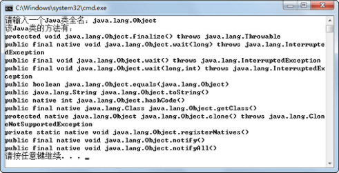
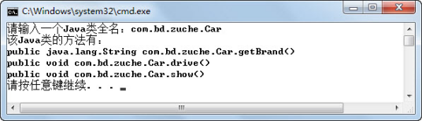

## 5.1  Java反射机制

 

&emsp;&emsp;Java反射（Reflection）就是Java程序在运行时，可以加载、探知、使用编译期间完全未知的类。也就是说，Java程序可以加载一个运行时才得知类名的类，获得类的完整构造方法，并实例化出对象，给对象属性设定值或者调用对象的方法。这种在运行时动态获取类的信息以及动态调用对象的方法的功能称为Java的反射机制。

### 5.1.1  反射引入  


&emsp;&emsp;在“租车系统”中，编写过一个驾驶员（租车者）Driver类，这个类有一个callShow(Vehicle v)方法，输入参数类型为Vehicle，通过这个方法显示指定车辆的信息。改造一下之前的代码，将Driver类作为程序入口类，具体代码如下：


```
import com.bd.zuche.*;

public class Driver 

{       

    String name = "驾驶员";

    public Driver(String name)

    {

        this.name = name;

    }

    public static void main(String[] args) 

    {

        Car car = new Car("战神","长城");

        Driver d1 = new Driver("柳海龙");

        d1.callShow(car);

    }

    //编译时知道需要传入的参数是Vehicle类型

    public void callShow(Vehicle v)

    {

        v.show();//调用Vehicle类的相关方法

    }

}
```


&emsp;&emsp;很显然，程序员在编码时就已经确定Driver类的callShow(Vehicle v)方法，输入参数类型为Vehicle，在该方法内部，调用Vehicle类的show()方法，显示车辆信息。但是，如果在编译的时候并不知道传入参数的类型是什么，这时候就需要使用反射机制。

&emsp;&emsp;假设有这样的需求，程序在运行时要求用户输入一个Java类全名，然后需要程序列出这个Java类的所有方法，该如何办呢？请看下面的代码：


```
import java.util.Scanner;

import java.lang.reflect.*; 

import com.bd.zuche.*;

class TestRef

{

public static void main(String[] args) 

{

Scanner input = new Scanner(System.in);

System.out.print("请输入一个Java类全名：");

String cName = input.next();

showMethods(cName);

}

public static void showMethods(String name)

{

try{

Class c = Class.forName(name);

Method m[] = c.getDeclaredMethods(); 

System.out.print("该Java类的方法有：");

for (int i = 0; i < m.length; i++)

{

System.out.println(m[i].toString()); 

}

}catch (Exception e){

e.printStackTrace();

}

}

}
```


&emsp;&emsp;编译、运行程序，在运行时分别输入java.lang.Object和com.bd.zuche.Car，运行结果如图5.1和图5.2所示，图中列出了Object类和Car类的所有方法。


<p align="center"></p>  
<p align="center">图5.1  Object类的所有方法</p>  


<p align="center"></p>  
<p align="center">图5.2  Car类的所有方法</p>  


&emsp;&emsp;这是个很有意思的案例，当用户输入类名的时候，程序能自动给用户列出这个类的所有方法。用过Eclipse这种集成开发环境的开发者可能会觉得似曾相识，比如程序员使用Eclipse定义了一个类Car，里面写了一些方法，再创建Car类对象car并输入car.时，Eclipse会弹出car对象可用的方法给程序员选择，这就是反射机制最常见的例子。

&emsp;&emsp;作为程序员，编写简单的Java程序时，使用反射机制的机会不多。反射机制一般在框架中使用较多，因为框架要适用更多的情况，对灵活性要求较高，而反射机制正好能解决这种灵活性要求。

 
