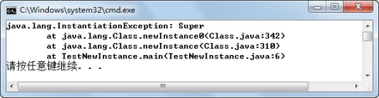
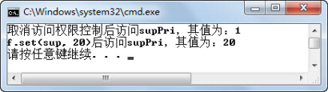

## 5.4  动态调用

&emsp;&emsp;到目前为止，都是通过Class类的方法获取了对应类的属性、方法和构造方法的详细信息，如果只是获取类的相关信息，那么 Java 反射机制的意义就体现不出来了。接下来，将通过之前获取的属性、方法和构造方法的详细信息，来动态创建对象、修改属性和动态调用方法。

### 5.4.1  创建对象  

&emsp;&emsp;前面已经通过Class类获得对应类的构造方法，一旦获取了对应类的构造方法，很自然地就会想到通过这些构造方法创建出这些对应类的实例对象，之后再通过这些对象完成程序需要实现的目标。接下来继续通过案例来演示如何实例化对象。

&emsp;&emsp;为了方便演示，用来测试的对应类Super的代码调整如下：


```
class Super

{       

private int supPri = 1;

int supPac = 2;

protected double supPro = 3;

public String supPub = "4";

 

public Super(){}

public Super(int pri,int pac,double pro,String pub)

{

this.supPri = pri;

this.supPac = pac;

this.supPro = pro;

this.supPub = pub;

}

protected Super(int pri,int pac,double pro){this(pri,pac,pro,"4");}

Super(int pri,int pac)throws Exception{this(pri,pac,3.0,"4");}

private Super(int pri){this(pri,2,3.0,"4");}

 

private void supPrivate(){}

int supPackage(){return supPac;}

protected double supProtected(){return supPro;}

public String supPublic(){return supPub;}

}

 

l 通过Class类的newInstance()方法创建对象

 

public class TestNewInstance{

public static void main(String args[]) {

try {

Class c = Class.forName("Super");

//通过Class类的newInstance()方法创建对象

Super sup = (Super)c.newInstance();

System.out.println(sup.supPublic());

} catch (Exception e) {

e.printStackTrace();

}

}

}
```


&emsp;&emsp;编译、运行程序，通过Class类的newInstance()方法创建Super对象（需要强制类型转换），然后调用这个对象的supPublic()方法，输出结果为4。

&emsp;&emsp;到目前为止，似乎可以看出点反射机制的端倪—可以根据用户运行时输入的信息，动态创建不同的对象，再调用对象的方法执行相关的功能。

&emsp;&emsp;通过Class类的newInstance()方法创建对象，该方法要求该Class对应类有无参构造方法。执行newInstance()方法实际上就是使用对应类的无参构造方法来创建该类的实例，其代码等价于：


```
Super sup = new Super();
```


&emsp;&emsp;如果Super类没有无参构造方法，运行程序时则会出现如图5.11所示的问题，抛出一个InstantiationException实例化异常。


<p align="center"></p>  
<p align="center">图5.11  newInstance()方法产生实例化异常</p>  


- 过Constructor的newInstance(Object[] args)方法创建对象

&emsp;&emsp;如果要想使用有参构造方法创建对象，则需要先通过Class对象获取指定的Constructor对象，再调用Constructor对象的newInstance(Object[] args)方法来创建该Class对象对应类的实例。具体代码如下：


```
import java.lang.reflect.*;

public class TestNewInstance1{

public static void main(String args[]) {

try {

Class c = Class.forName("Super");

//返回一个指定参数列表(int.class,int.class)的Constructor对象

Constructor con = c.getDeclaredConstructor(new Class[]{int.class,int.class});

//通过Constructor的newInstance(Object[] args)方法创建对象，参数为对象列表

//参数列表对基本数据类型支持自动装箱拆箱，所以也可以写成newInstance(21, 22)

Super sup = (Super)con.newInstance(new Object[]{21, 22});

System.out.println(sup.supPackage());

 

//返回一个无参的Constructor对象

Constructor con2 = c.getDeclaredConstructor();

//通过Constructor的newInstance()方法创建无参对象

Super sup2 = (Super)con2.newInstance();                           

System.out.println(sup2.supProtected());

} catch (Exception e) {

e.printStackTrace();

}

}

}
```


&emsp;&emsp;编译、运行程序，输出结果为22和3.0。需要注意的是，通过Class对象获得指定Constructor对象的方法getDeclaredConstructor((Class[] args))中，参数列表为Class类数组。本例中直接使用new Class[]{int.class,int.class}语句创建了这个Class类数组，表示需要获取的构造方法内含有两个int型的形参。之后调用Constructor的newInstance(Object[] args)方法创建对象时，输入参数为Object对象数组，本例中直接使用new Object[]{21, 22}创建了此对象数组。

&emsp;&emsp;通过 Constructor 的 newInstance()方法，也可以创建无参对象，这样在调用getDeclaredConstructor((Class[] args))和newInstance(Object[] args)方法时，参数列表为空即可。

### 5.4.2  修改属性  

&emsp;&emsp;还是上面的Super类，其中有一个整型的私有属性supPri，初始值为1。因为Super类并没有提供针对supPri这个属性的公有的getter和setter方法，所以在这个类外，以现有的知识是无法获得并修改这个属性值的。接下来通过Java反射机制提供的Field类，实现在程序运行时修改类中私有属性值的功能。具体代码如下：


```
import java.lang.reflect.*;

public class TestChangeField{

public static void main(String args[]) {

try {

Class c = Class.forName("Super");

Super sup = (Super)c.newInstance();

//通过属性名获得Field对象

Field f = c.getDeclaredField("supPri");//supPri为私有属性

//取消属性的访问权限控制，即使private属性也可以进行访问     

f.setAccessible(true);

//调用get(Object o)方法取得对象o对应属性值

System.out.println("取消访问权限控制后访问supPri，其值为：" + f.get(sup));

//调用set(Object o,Object v)方法设置对象o对应属性值

f.set(sup, 20); 

System.out.println("f.set(sup, 20)后访问supPri，其值为：" + f.get(sup));          

} catch (Exception e) {

e.printStackTrace();

}

}

}
```


&emsp;&emsp;代码中，首先通过Class对象的getDeclaredField("supPri")方法获得了Field对象f，然后通过f.setAccessible(true)方法取消了supPri属性的访问控制权限（只是取消Field对象f对应属性supPri的访问控制权限，在Field对象内部起作用，仍不可以通过sup.supPri直接进行访问），之后再通过set(Object o,Object v)、get(Object o)，修改、获取该属性的值。编译、运行程序，运行结果如图5.12所示。


<p align="center"></p>  
<p align="center">图5.12  通过Field对象修改私有属性</p>  


### 5.4.3  调用方法  

&emsp;&emsp;通过反射机制，运行时可以根据用户的输入创建不同的对象，并且可以修改属性的访问控制权限及属性值。接下来将介绍使用反射机制，通过调用Method类的一些方法，动态执行Class对应类的方法。

&emsp;&emsp;前面介绍使用反射机制创建对象时，程序可以根据用户的输入动态创建一个对象。假设现在有这样的需求，需要在程序运行时，根据用户提供的方法名称、参数个数、参数类型，动态调用不同的方法完成不同的功能。

&emsp;&emsp;例如TestInvokeMethod类中有四个方法，public int add(int x, int y)、public int add(int x)、public int multiply(int x, int y)、public int multiply(int x)，分别实现的功能是求和、加一、求乘积、求平方四个功能。程序运行时，用户输入方法和实参列表，程序动态调用对应的方法，将结果反馈给用户。具体代码如下（因为篇幅原因，程序中直接给出了方法和实参列表，没有要求用户输入）：


```
import java.lang.reflect.*;

public class TestInvokeMethod{              

public int add(int x, int y) {

return x + y;

}                

public int add(int x) {

return x + 1;

}

public int multiply(int x, int y) {

return x * y;

}                

public int multiply(int x) {

return x * x;

}

public static void main(String args[]) {

try {

Class c = TestInvokeMethod.class;

Object obj = c.newInstance();

//通过方法名、参数类型列表，获得Method对象

Method m = c.getDeclaredMethod("multiply",new Class[]{int.class, int.class});

//invoke(Object o,Object[] args)方法调用对象o对应方法

System.out.println("调用方法：multiply，输入值为int型3和4，结果为："

\+ m.invoke(obj,new Object[]{3,4}));

Method m2 = c.getDeclaredMethod("add",new Class[]{int.class});

System.out.println("调用方法：add，输入值为int型18，结果为："

\+ m2.invoke(obj,new Object[]{18}));

} catch (Exception e) {

e.printStackTrace();

}

}

}
```


&emsp;&emsp;程序运行时获得方法名multiply以及实参列表3和4，通过getDeclaredMethod ("multiply",new Class[]{int.class, int.class})方法获得Method对象m，再通过m.invoke(obj, newObject[]{3,4})方法调用对象obj（可能也是通过反射机制动态创建的）对应方法public int multiply(int x, int y)取得需要的结果。程序如果获得的方法名为add，参数列表为18，则反射机制的动态方法调用会执行对象的public int add(int x)方法。程序运行结果如图5.13所示。


<p align="center"></p>  
<p align="center">图5.13  通过Method对象动态调用方法</p>  


&emsp;&emsp;至此，反射机制的核心内容已介绍完毕。其中根据用户的输入，使用反射机制动态创建对象，动态调用方法是Java反射机制的精髓，学习它对后期框架课程的深入理解很有帮助。

 

 


