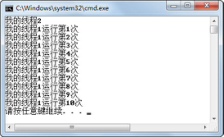

## 6.4  线程控制


&emsp;&emsp;对于6.2.2小节的TestThread案例，多运行几次，也许会发现，有时候出现图6.3的运行结果，也有时候出现图6.4的运行结果。比较两次输出的差异在于，图6.3的显示结果表明线程类对象t1的run()方法先开始被执行，然后才开始执行线程类对象t2的run()方法，而图6.4的显示结果却正好相反。通过这样的显示结果说明，作为程序员无法控制线程什么时候从就绪状态调度进入运行状态，即无法控制什么时候run()方法被执行。程序员可以做的就是通过start()方法保证线程进入就绪状态，等待系统调度程序决定什么时候该线程调度进入运行状态。


<p align="center"></p>  
<p align="center">图6.4  多线程程序</p>  


### 6.4.1  线程控制方法  

&emsp;&emsp;下面列举了Thread类的一些线程控制的方法。

- void start()

&emsp;&emsp;使该线程开始执行，Java虚拟机负责调用该线程的run()方法。

- void sleep(long millis) 

&emsp;&emsp;静态方法，线程进入阻塞状态，在指定时间（单位为毫秒）到达之后进入就绪状态。 

- void yield()

&emsp;&emsp;静态方法，当前线程放弃占用CPU资源，回到就绪状态，使其他优先级不低于此线程的线程有机会被执行。

- void join() 

&emsp;&emsp;只有当前线程等待加入的（join）线程完成，才能继续往下执行。 

- void interrupt()

&emsp;&emsp;中断线程的阻塞状态（而非中断线程），例如一个线程sleep(1000000000)，为了中断这个过长的阻塞过程，则可以调用该线程的interrupt()方法，中断阻塞。需要注意的是，此时sleep()方法会抛出InterruptedException异常。

- void isAlive()

&emsp;&emsp;判定该线程是否处于活动状态，处于就绪、运行和阻塞状态的都属于活动状态。

- void setPriority(int newPriority)

&emsp;&emsp;设置当前线程的优先级。

- int getPriority()

&emsp;&emsp;获得当前线程的优先级。

### 6.4.2  终止线程  

&emsp;&emsp;线程通常在三种情况下会终止，最普遍的情况是线程中的run()方法执行完毕后线程终止，或者线程抛出了Exception或Error且未被捕获，另外还有一种方法是调用当前线程的stop()方法终止线程（该方法已被废弃）。接下来，通过案例来演示如何通过调用线程类内部方法实现终止线程的功能。

&emsp;&emsp;有这样一个程序，程序内部有一个计数功能，每间隔2秒输出1、2、3……一直到100结束。现在有这样的需求，当用户想终止这个计数功能时，只要在控制台输入s即可，具体程序代码如下：


```
import java.util.Scanner;

public class EndingThread{

public static void main(String[] args) {

CountThread t = new CountThread();

t.start();

Scanner scanner = new Scanner(System.in);

System.out.println("如果想终止输出计数线程，请输入s");

while(true){

String s = scanner.nextLine();

if(s.equals("s")){

t.stopIt();

break;

}

}

}

}

//计数功能线程

class CountThread extends Thread {

private int i = 0;

public CountThread(){

super("计数线程");

}

//通过设置i=100，让线程终止

public void stopIt(){

i = 100;

}

public void run(){

try{

while(i < 100){

System.out.println(this.getName() + "计数：" + (i+1));

i++;

sleep(2000);

}

}catch(Exception e){

e.printStackTrace();

}

}

}
```


&emsp;&emsp;程序中，CountThread线程类实现了计数功能。当主程序调用t.start()方法启动线程时，执行CountThread线程类里run()方法的输出计数功能。主程序中通过while循环，在控制台获取用户输入，当用户输入为s时，调用CountThread线程类的stopIt()方法，改变run()方法中运行的条件，即可终止该线程的执行。

&emsp;&emsp;编译、运行程序，在程序运行时输入s。程序运行结果如图6.5所示。


<p align="center"></p>  
<p align="center">图6.5  终止线程</p>  


### 6.4.3  线程等待和中断等待  

&emsp;&emsp;Thread类的静态方法sleep()，可以让当前线程进入等待（阻塞状态），直到指定的时间流逝，或直到别的线程调用当前线程对象上的interrupt()方法。下面的案例演示了调用线程对象的interrupt()方法，中断线程所处的阻塞状态，使线程恢复进入就绪状态，具体代码如下：


```
public class InterruptThread{

public static void main(String[] args) {

CountThread t = new CountThread();

t.start();               

try{

Thread.sleep(6000);

}catch(InterruptedException e){

e.printStackTrace();

}       

//中断线程的阻塞状态（而非中断线程）

t.interrupt();

}

}

class CountThread extends Thread {

private int i = 0;

public CountThread(){

super("计数线程");

}

public void run(){

while(i < 100){

try{

System.out.println(this.getName() + "计数：" + (i+1));

i++;

Thread.sleep(5000);

}catch(InterruptedException e){

System.out.println("程序捕获了InterruptedException异常!");

}

System.out.println("计数线程运行1次！");

}

}

}
```


&emsp;&emsp;请注意计数线程的变化，计数线程的异常处理代码放在了while循环以内，也就是说如果主程序调用interrupt()方法中断了计数线程的阻塞状态（由sleep(5000)引起的），并处理了由计数线程抛出的InterruptedException异常之后，计数线程将会进入就绪状态和运行状态，执行sleep(5000)之后的程序，继续循环输出。

&emsp;&emsp;主程序通过start()方法启动了计数线程以后，调用sleep(6000)方法让主程序等待6秒，此时计数线程已执行到第2次循环，“计数线程计数：1”、“计数线程运行1次！”和“计数线程计数：2”已经输出，正在执行sleep(5000)的代码。因为计数线程的interrupt()方法被调用，则中断了 sleep(5000)代码的执行，捕获了 InterruptedException 异常，输出“程序捕获了InterruptedException异常!”，之后计数线程立即恢复，继续执行。程序运行结果如图6.6所示。


<p align="center"></p>  
<p align="center">图6.6  线程等待和中断等待</p>  


&emsp;&emsp;接下来介绍另外一个让线程放弃CPU资源的方法：yield()方法。

&emsp;&emsp;yield()方法和sleep()方法都是Thread类的静态方法，都会使当前处于运行状态的线程放弃CPU资源，把运行机会让给别的线程。但两者的区别在于：

&emsp;&emsp;（1）sleep()方法会给其他线程运行的机会，不考虑其他线程的优先级，因此会给较低优先级线程一个运行的机会；yield()方法只会给相同优先级或者更高优先级的线程一个运行的机会。

&emsp;&emsp;（2）当线程执行了sleep(long millis)方法，将转到阻塞状态，参数millis指定了睡眠时间；当线程执行了yield()方法，将转到就绪状态。

&emsp;&emsp;（3）sleep()方法声明抛出InterruptedException异常，而yield()方法没有声明抛出任何异常。

&emsp;&emsp;yield()方法只会给相同优先级或者更高优先级的线程一个运行的机会，这是一种不可靠的提高程序并发性的方法，只是让系统的调度程序再重新调度一次，在实际编程过程中很少使用。

### 6.4.4  等待其他线程完成  

&emsp;&emsp;Thread类的join()方法，可以让当前线程等待加入的线程完成，才能继续往下执行。下面通过一个案例来演示join()方法的使用。


```
public class JoinThread{

public static void main(String[] args)throws InterruptedException{              

SThread st = new SThread();

QThread qt = new QThread(st);

qt.start();

st.start();

}

}

class QThread extends Thread{

int i = 0;

Thread t = null;

//构造方法，传入一个线程对象

public QThread(Thread t){

super("QThread线程");

this.t = t;

}

public void run(){

try{

while(i < 100){

//当i=5，调用传入线程对象的join()方法，等传入线程执行完毕再执行本线程

if(i != 5){

Thread.sleep(500);

System.out.println("QThread正在每隔0.5秒输出数字：" + i++);

}else{

t.join();

}

}

}catch(InterruptedException e){

e.printStackTrace();

}

}

}

class SThread extends Thread{

int i = 0;

//从0输出到99

public void run(){

try{

while(i < 100){

Thread.sleep(1000);

System.out.println("SThread正在每隔1秒输出数字：" + i++);

}

}catch(InterruptedException e){

e.printStackTrace();

}

}

}
```


&emsp;&emsp;案例中有两个线程类QThread类和SThread类，其中，QThread线程类的run()方法中每隔0.5秒从0到99依次输出数字，SThread线程类的run()方法中每隔1秒从0到99依次输出数字。QThread线程类有一个带参的构造方法，传入一个线程对象。在QThread线程类的run()方法中，当输出数值等于5时，调用构造方法中传入的线程对象的join()方法，让传入的线程对象全部执行完毕以后，再继续执行本线程的代码。程序运行结果如图6.7所示。


<p align="center"></p>  
<p align="center">图6.7  线程join()方法使用</p>  


&emsp;&emsp;从图6.7可以看出，当QThread线程类执行到i=5时，开始等待SThread线程类执行完毕，才会继续执行自身的代码。

### 6.4.5  设置线程优先级  

&emsp;&emsp;在介绍线程的优先级前，先介绍一下线程的调度模型。同一时刻如果有多个线程处于就绪状态，则它们需要排队等待调度程序分配CPU资源。此时每个线程自动获得一个线程的优先级，优先级的高低反映线程的重要或紧急程度。就绪状态的线程按优先级排队，线程调度依据的是优先级基础上的“先到先服务”原则。

&emsp;&emsp;调度程序负责线程排队和CPU资源在线程间的分配，并根据线程调度算法进行调度。当线调度程序选中某个线程时，该线程获得CPU资源从而进入运行状态。

&emsp;&emsp;线程调度是抢占式调度，即如果在当前线程执行过程中一个更高优先级的线程进入就绪状态，则这个线程立即被调度执行。抢占式调度又分为独占式和分时方式。独占方式下，当前执行线程将一直执行下去，直到执行完毕或由于某种原因主动放弃CPU资源，或CPU资源被一个更高优先级的线程抢占。分时方式下，当前运行线程获得一个CPU时间片，时间到时即使没有执行完也要让出CPU资源，进入就绪状态，等待下一个时间片的调度。

&emsp;&emsp;线程的优先级由数字1～10表示，其中1表示优先级最高，默认值为5。尽管JDK给线程优先级设置了10个级别，但仍然建议只使用MAX_PRIORITY（级别为1）、NORM_PRIORITY（级别为5）和MIN_PRIORITY（级别为10）三个常量来设置线程优先级，让程序具有更好的可移植性。接下来看看下面的案例：


```
public class SetPriority{

public static void main(String[] args)throws InterruptedException{

QThread qt = new QThread();                 

SThread st = new SThread();

//给qt设置低优先级，给st设置高优先级

qt.setPriority(Thread.MIN_PRIORITY);

st.setPriority(Thread.MAX_PRIORITY);

qt.start();

st.start();

}

}

class QThread extends Thread{

int i = 0;

public void run(){

while(i < 100){

System.out.println("QThread正在输出数字：" + i++);

}

}

}

class SThread extends Thread{

int i = 0;

public void run(){

while(i < 100){

System.out.println("SThread正在输出数字：" + i++);

}

}

}
```


&emsp;&emsp;编译、运行程序，运行结果如图6.8所示。


<p align="center"></p>  
<p align="center">图6.8  线程优先级设置</p>  


&emsp;&emsp;看到这样的运行结果大家就开始疑惑了，明明将SThread线程类对象st的优先级设置成最高，将QThread线程类对象qt的优先级设置成最低，启动两个线程，结果并不是优先级高的一直先执行，优先级低的一直后执行。

&emsp;&emsp;原因是设置线程优先级，并不能保证优先级高的先运行，也不保证优先级高的可以获得更多的CPU资源，只是给操作系统调度程序提供一个建议而已，到底运行哪个线程，是由操作系统决定的。

### 6.4.6  守护线程  

&emsp;&emsp;守护线程是为其他线程的运行提供便利的线程。Java的垃圾收集机制的某些实现就使用了守护线程。

&emsp;&emsp;程序可以包含守护线程和非守护线程，当程序只有守护线程时，该程序便可以结束运行。

&emsp;&emsp;如果要使一个线程成为守护线程，则必须在调用它的start()方法之前进行设置（通过以true作为参数调用线程的setDaemon()方法，可以将该线程设置为一个守护线程）。如果线程是守护线程，则isDaemon()方法返回为true。

&emsp;&emsp;接下来看一个简单的案例：


```
public class DaemonThread{

public static void main(String[] args) {

DThread t = new DThread();

t.start();               

System.out.println("让一切都结束吧");

}

private static class DThread extends Thread{

//在无参构造方法中设置本线程为守护线程

public DThread() {

setDaemon(true);

}

public void run() {

while(true){

System.out.println("我是后台线程");

}

}

}

}
```


&emsp;&emsp;编译、运行程序，程序输出“让一切都结束吧”后立刻退出。从程序运行结果可以看出，虽然程序中创建并启动了一个线程，并且这个线程的run()方法在无条件循环输出。但是因为程序启动的是一个守护进程，所以当程序只有守护线程时，该程序结束运行。

 


