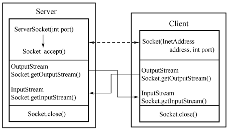
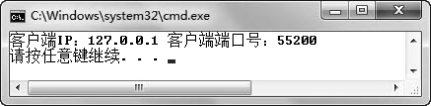
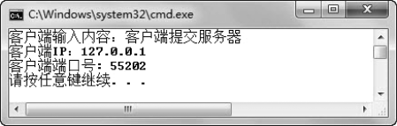
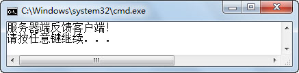
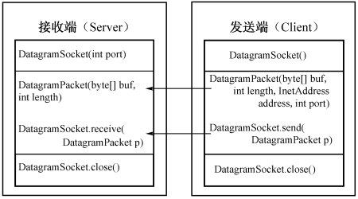
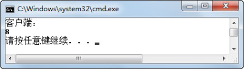

## 7.7  Socket编程

 

&emsp;&emsp;所谓Socket通常也称作套接字，应用程序通常通过套接字向网络发出请求或者应答网络请求。Java语言中的Socket编程常用到Socket和ServerSocket这两个类，它们位于java.net包中。

### 7.7.1  基于TCP的Socket编程  

&emsp;&emsp;ServerSocket用于服务器端，而Socket是建立网络连接时使用的。在连接成功时，应用程序两端都会产生一个Socket实例，操作这个实例，完成所需的会话。对于一个网络连接来说，套接字是平等的，不因为在服务器端或在客户端而产生不同级别。不管是Socket还是ServerSocket，它们的工作都是通过SocketImpl类及其子类完成的。关于Socket、ServerSocket及SocketImpl类的具体方法，这里不再一一介绍，需要这些类时，请大家自行查阅JDK API文档。

&emsp;&emsp;图7.7展示了基于TCP的Socket编程的示意图。


<p align="center"></p>  
<p align="center">图7.7  基于TCP的Socket编程</p>  


&emsp;&emsp;在服务器端，创建一个ServerSocket对象，并指定一个端口号，使用ServerSocket类的accept()方法使服务器处于阻塞状态，等待用户请求。

&emsp;&emsp;在客户端，通过指定一个InetAddress对象和一个端口号，创建一个Socket对象，通过这个Socket对象，连接到服务器。

&emsp;&emsp;首先来看服务器端程序，具体代码如下：


```
import java.net.*;

import java.io.*;

public class TestServer{

public static void main(String args[]) {

try{

//创建一个ServerSocket对象，并指定端口号[[张彬2\]](#_msocom_2) 8888

ServerSocket s = new ServerSocket(8888);

while(true){

//侦听并接受到此套接字的连接

Socket s1 = s.accept();

OutputStream os = s1.getOutputStream();

DataOutputStream dos = new DataOutputStream(os);

dos.writeUTF("客户端IP：" + s1.getInetAddress().getHostAddress() + " 

客户端端口号：" + s1.getPort());

dos.close();

s1.close();

}

}catch (IOException e) {

e.printStackTrace();

System.out.println("程序运行出错！");                   

}

}

}
```


&emsp;&emsp;该服务器端程序的作用就是监听8888端口，当有发送到本机8888端口的Socket请求时，建立输出流，将通过accept()方法创建的Socket对象的IP地址和端口号输出到客户端。编译、运行程序，使服务器启动并处于监听状态。

&emsp;&emsp;下面编写客户端程序，具体代码如下：


```
import java.net.*;

import java.io.*;

public class TestClient{

public static void main(String args[]){

try{

//通过IP地址和端口号，创建一个Socket对象

Socket s1 = new Socket("127.0.0.1", 8888);

//建立输入数据流

InputStream is = s1.getInputStream();

DataInputStream dis = new DataInputStream(is);

System.out.println(dis.readUTF());

dis.close();

s1.close();

}catch(ConnectException e){

e.printStackTrace();

System.err.println("服务器连接失败！");

}catch(IOException e){

e.printStackTrace();

}

}

}
```


&emsp;&emsp;该客户端程序通过IP地址127.0.0.1和端口号8888，创建一个客户端Socket对象，建立输入数据流，通过输入数据流读取指定IP地址和端口号上服务器端程序的输出，并在控制台将服务器的输出显示出来。编译、运行程序，运行结果如图7.8所示。


<p align="center"></p>  
<p align="center">图7.8  使用Java Socket编程</p>  


&emsp;&emsp;在这个通过Java Socket编程实现的客户端、服务器端程序中，客户端没有请求的具体内容，只要有请求，服务器就将指定的内容发送给客户端，客户端将接收的内容显示出来。接下来对上面的案例进行调整，服务器端可以接收客户端请求的内容，并显示在服务器端控制台上。服务器端程序具体代码如下：


```
import java.io.*; 

import java.net.*;

public class TestSockServer {

public static void main(String[] args) {

InputStream in = null; 

OutputStream out = null;

try{

ServerSocket s = new ServerSocket(8888);

Socket s1 = s.accept();

in = s1.getInputStream(); 

out = s1.getOutputStream();

DataOutputStream dos = new DataOutputStream(out);

DataInputStream dis = new DataInputStream(in);

String str = null;

if((str = dis.readUTF())!= null) {

System.out.println("客户端输入内容：" + str);

System.out.println("客户端IP：" + s1.getInetAddress().getHostAddress());

System.out.println("客户端端口号：" + s1.getPort());

}

dos.writeUTF("服务器端反馈客户端！"); 

dis.close();

dos.close();

s1.close();

}catch(IOException e){

e.printStackTrace();

}

}

}
```


&emsp;&emsp;客户端具体代码如下：


```
import java.net.*;

import java.io.*;

public class TestSockClient {

public static void main(String[] args) {

InputStream is = null; 

OutputStream os = null;

String s = null;

try{

Socket socket = new Socket("localhost",8888);

is = socket.getInputStream();

os = socket.getOutputStream();

DataInputStream dis = new DataInputStream(is);

DataOutputStream dos = new DataOutputStream(os);

//客户端向服务器端发送请求的内容

dos.writeUTF("客户端提交服务器"); 

if((s = dis.readUTF()) != null)

System.out.println(s); 

dos.close();

dis.close();

socket.close();

}catch(UnknownHostException e){

e.printStackTrace();

}catch(IOException e){

e.printStackTrace();

}

}

}

```

&emsp;&emsp;编译、运行服务器端、客户端程序，运行结果分别如图7.9和图7.10所示。


<p align="center"></p>  
<p align="center">图7.9  Socket编程服务器端</p>  


<p align="center"></p>  
<p align="center">图7.10  Socket编程客户端</p>  


### 7.7.2  基于UDP的Socket编程  

&emsp;&emsp;UDP是用户数据报协议，它提供的是无连接、不可靠信息传送服务。Java 主要提供了两个类来实现基于UDP的Socket编程。

&emsp;&emsp;DatagramSocket：此类表示用来发送和接收数据报包的套接字。数据报套接字是包投递服务的发送或接收点，每个在数据报套接字上发送或接收的包都是单独编址和路由的。从一台机器发送到另一台机器的多个包可能选择不同的路由，也可能按不同的顺序到达。在 DatagramSocket上总是启用UDP广播发送。

&emsp;&emsp;DatagramPacket：此类表示数据报包。数据报包用来实现无连接包投递服务，每条报文仅根据该包中包含的信息从一台机器路由到另一台机器。

&emsp;&emsp;图7.11展示了基于UDP的Socket编程的示意图。


<p align="center"></p>  
<p align="center">图7.11  基于UDP的Socket编程</p>  


&emsp;&emsp;DatagramPacket类主要有两个构造函数。

&emsp;&emsp;一个用来接收数据DatagramPacket(byte[] recyBuf, int readLength)，用一个字节数组接收UDP包，recyBuf数组在传递给构造函数时是空的，而readLength值用来设定要读取的字节数。

&emsp;&emsp;一个用来发送数据DatagramPacket(byte[] sendBuf, int sendLength, InetAddress iaddr, int port)，建立将要传输的UDP包，并指定IP地址和端口号。

&emsp;&emsp;接下来通过一个案例来演示Java如何实现基于UDP的Socket编程，其中服务器端代码如下：


```
import java.net.*;

import java.io.*;

public class TestUDPServer{

public static void main(String args[]) throws Exception

{

//创建数据报包的套接字，端口号8888

DatagramSocket ds = new DatagramSocket(8888);            

byte buf[] = new byte[1024];

//创建接收的数据报包

DatagramPacket dp = new DatagramPacket(buf,buf.length);

System.out.println("服务器端：");

while(true)

{

//从此套接字接收数据报包

ds.receive(dp);

ByteArrayInputStream bais = new ByteArrayInputStream(buf);

DataInputStream dis = new DataInputStream(bais);

System.out.println(dis.readLong());

}

}

}

```

客户端代码如下：


```
import java.net.*;

import java.io.*;

public class TestUDPClient{

public static void main(String args[]) throws Exception

{

long n = 10000L;

ByteArrayOutputStream baos = new ByteArrayOutputStream();

DataOutputStream dos = new DataOutputStream(baos);

dos.writeLong(n);

byte[] buf = baos.toByteArray();

System.out.println("客户端：");

System.out.println(buf.length);

//创建数据报包的套接字，端口号9999

DatagramSocket ds = new DatagramSocket(9999);

//创建发送的数据报包

DatagramPacket dp = new DatagramPacket(buf, buf.length, 

new InetSocketAddress("127.0.0.1", 8888));

//从此套接字发送数据报包

ds.send(dp);

ds.close();

​                  

}

}
```


&emsp;&emsp;编译、运行程序，运行结果如图7.12和图7.13所示。


<p align="center"></p>  
<p align="center">图7.12  UDP Socket编程服务器端</p>  


<p align="center"></p>  
<p align="center">图7.13  UDP Socket编程客户端</p>  


