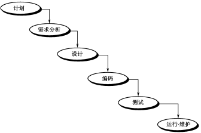
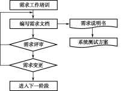

## 10.4  软件测试

 

&emsp;&emsp;软件测试是最近数十年软件企业一直比较关心的话题之一，是软件开发过程中不可缺少的一部分，对于发现软件缺陷、保证软件产品质量具有不可替代的作用。本小节将介绍软件测试的概念以及测试与调试的区别，使大家对软件测试有个初步的了解。

### 10.4.1  软件测试概述  

#### 1．软件测试的概念

&emsp;&emsp;《软件测试的艺术》是关于软件测试的一本经典著作，其作者Glenford J. Myers曾经对软件测试进行了这样的定义：软件测试就是为了发现错误而执行程序或者系统的过程。这一定义明确了软件测试的根本目的是发现程序中的错误。

&emsp;&emsp;Myers撰写该著作的时期是在20世纪70年代末期，软件测试通常在软件产品开发的后期开始，主要目的就是寻找软件产品运行过程中的缺陷。因此，他对软件测试所下的这一定义被人们广泛接受，反映了人们在当时对软件测试所持的观点。

&emsp;&emsp;随着时间的推移以及行业的发展，人们逐渐发现了其定义中的不足。于是，在20世纪80年代中期，在IEEE提出的软件工程标准术语中，调整了对软件测试的定义，即使用人工或自动手段来运行或测试某个系统的过程，其目的在于检验它是否满足规定的需求或弄清预期结果与实际结果之间的差别。

&emsp;&emsp;更新后的定义除吸收了之前人们对软件测试定义中的精华外，还明确指出，软件测试作为保证软件质量的一个重要手段，其主要任务是在已设计测试用例的基础上检验软件各个部分，以及整个系统是否正确、完整地实现了预定的功能，以确保软件质量。

&emsp;&emsp;今天，人们对软件测试有了更进一步的认识，从广义上讲，测试是指软件产品生存周期内所有的检查、评审和确认活动。例如设计评审、单元测试、系统测试等。从狭义上讲，测试是对软件产品质量的检验和评价。

&emsp;&emsp;如今，软件行业的人员对软件测试有如下直观的认识。

- 保证程序和需求规格说明书等其他文档一致。

- 发现软件中的缺陷，确保系统能正常运行。

- 做软件应该做的事，不做软件不应该做的事。

&emsp;&emsp;现代软件测试活动一般包含以下内容：

&emsp;&emsp;（1）编写测试计划。

&emsp;&emsp;（2）设计测试用例。

&emsp;&emsp;（3）实施测试，提交缺陷报告。

&emsp;&emsp;（4）测试评估和总结。

&emsp;&emsp;从另一个角度看，软件测试与软件开发过程中其他工作在性质上存在很大的差异。其他工作往往是“建设性”的，而测试工作却有着很大的“破坏性”，努力证明程序中有错误，不能按照用户的要求正确工作。软件测试的根本目的是尽可能多地发现问题并排除潜在的错误，最终把一个高质量的软件系统交给用户使用。

#### 2．测试与调试

&emsp;&emsp;有不少对软件测试不了解的人会认为测试和调试是一回事，而实际上测试与调试有本质的区别。简单地说，测试的主要工作是找缺陷，而调试的目的是解决缺陷。软件调试与软件测试不同，软件测试的目标是尽可能多地发现软件中的错误，而进一步诊断和改正程序中的错误才是调试的任务。

&emsp;&emsp;通常，调试是一个具有很强技巧性的工作，一个开发人员在分析程序错误时会发现，软件出现问题往往只是潜在错误的外部表现，而外部表现与内在原因之间常常缺乏明显的联系。要找出真正的原因，排除潜在的错误，不是一件容易的事情。因此可以说，调试是通过现象找出原因的一个思维分析的过程。

&emsp;&emsp;另外还有两点也是测试和调试的区别，一是测试是贯穿在整个软件生命周期中的，包括需求分析、概要设计、详细设计、编码、测试和运行维护的全过程，而调试主要在开发阶段，尤其在开发的中后期。二是测试的执行者是测试人员和开发人员，而调试仅由开发人员完成，一般测试人员不参与。

### 10.4.2  软件缺陷及处理流程  

&emsp;&emsp;在软件测试过程中，软件测试工程师发现的问题、错误，就是软件缺陷，通常也称为Bug。本节将介绍如何确定软件缺陷以及作为一名软件测试工程师如何有效地记录缺陷。

#### 1．确定软件缺陷

&emsp;&emsp;通常人们在谈到软件缺陷时，总会把它和程序的错误联系在一起。比如说软件使用过程中出现的各种异常现象，例如软件产生了错误的输出结果，系统崩溃，网站慢得无法使用等，这些显然是软件缺陷。

&emsp;&emsp;对于这些软件缺陷而言，它们通常会在测试过程中，成为软件测试工程师关注的重点，也会被尽可能多地发现并且得到及时修改。然而，值得注意的是，软件缺陷并不仅仅是这些明显的程序错误，还包括所有未能满足目标群体（即用户）需求的问题。

&emsp;&emsp;任何一个软件产品都需要最大限度地满足用户的使用需求，但实际情况是任何软件产品都很难百分之百地满足用户的实际需求，软件产品只能通过不断地优化和改进而持续接近用户的需求。

&emsp;&emsp;通过上面的描述可以得知，在软件使用过程中所出现的任何问题，或者导致软件不能符合设计要求或满足用户需求的问题都可以说是软件缺陷，或称为Bug。

&emsp;&emsp;正确理解了软件缺陷的含义，可以帮助软件测试工程师比较容易地确定自己发现的一个问题是不是缺陷，可以说用户的需求是判断缺陷的关键。因此在确定缺陷的过程中，软件测试工程师可以从以下几个方面入手。

&emsp;&emsp;首先，可以将软件需求规格说明书、用户手册及联机帮助作为确定缺陷的主要工具，这些文档较为准确地反映了用户需求，所以被大多数软件测试工程师在实际测试过程中广泛使用。

&emsp;&emsp;其次，通过增加自己对所测试软件产品的行业背景知识的了解来发现被忽视的问题。这些问题中往往隐藏着软件的致命缺陷，而且作为用户方往往会认为知道这些是应该的，不需要明确写在需求里。

&emsp;&emsp;最后，通过沟通的方式来确定发现的问题是否是缺陷。主要是和研发人员沟通，和测试负责人沟通，当分歧很大时，可以交给项目负责人确认或者通过小型会议的形式讨论确认。

#### 2．有效记录缺陷

&emsp;&emsp;当软件测试工程师发现一个缺陷以后，就需要记录这个缺陷，并提交给开发人员。下面举一个非常简单的记录软件缺陷的案例。

&emsp;&emsp;缺陷描述：记事本中保存“联通”，再次打开后出现乱码！

&emsp;&emsp;缺陷步骤：

&emsp;&emsp;（1）打开记事本，输入“联通”（不带引号）。

&emsp;&emsp;（2）保存该文件到任意位置，文件名任意设置。

&emsp;&emsp;（3）再次打开这个文件，显示乱码，如图10.3所示。

  

图10.3  缺陷报告
  

&emsp;&emsp;缺陷报告是大多数软件测试工程师的主要工作结果之一。缺陷报告的读者在通过这些文档重现缺陷的同时，也通过文档了解了软件测试工程师。报告写得越好，软件测试工程师的声誉越高，以后的工作交流就会更容易。开发人员通过软件测试工程师的报告得知缺陷信息，对重要问题的准确报告会为软件测试工程师带来良好声誉，差的报告会为开发人员带来额外的工作。如果软件测试工程师浪费了开发人员太多的时间，开发人员就会对软件测试工程师的工作抱有怨言。因此为编写出高质量的缺陷报告，软件测试工程师需要牢记以下书写缺陷报告的准则。

- 保证重现缺陷

&emsp;&emsp;缺陷报告的作用是为了让软件开发人员能够及时准确地了解软件存在的缺陷，它是软件测试工程师与开发人员沟通的重要手段。因此必须保证软件缺陷报告能够清晰描述缺陷，保证开发人员可以根据缺陷报告描述步骤的引导百分之百地重现缺陷。

- 使用最少步骤记录缺陷

&emsp;&emsp;虽然说软件测试工程师只需要发现缺陷，不需要修复缺陷，但作为一个优秀的软件测试工程师，应该会分析问题，尽量使用最少的步骤记录缺陷。

&emsp;&emsp;用过于复杂的步骤描述软件缺陷会降低软件缺陷被修复的可能性。一方面，复杂的步骤和大量的文字可能没有真正提炼出出现缺陷的关键，却占用开发人员很多宝贵的时间，久而久之会引起开发人员的反感，从而降低提交这类缺陷报告人员的受信度。另一方面，如果记录缺陷的过程过于复杂，则会给开发人员重现缺陷的过程带来很大的困难，而且也会让开发人员不能将问题集中在主要的步骤上。

- 包含重现缺陷的必要步骤

&emsp;&emsp;之所以要求缺陷报告必须包含所有重现缺陷的必要步骤，是为了提高缺陷报告的易用性。在软件开发和测试过程中，软件测试工程师对软件各种功能是最熟悉的，因此在编写缺陷报告的过程中，一些常用的操作步骤很容易被软件测试工程师认为是想当然的而忽视记录，从而为开发人员重现缺陷埋下隐患。一方面，这些在报告中被忽视的步骤可能给开发人员重现缺陷带来困难；另一方面，当这类报告经过长时间之后再被打开，可能连提交者自己也无法立刻依据报告重现缺陷的产生过程。

- 客观、方便阅读

&emsp;&emsp;缺陷报告是描述性短文，在编写时要注意客观、方便阅读。

&emsp;&emsp;一是报告的核心部分是重现缺陷的步骤，那么应当分步骤描述。因此，要对操作过程进行编号，在书写格式上要求每个步骤独占一行。

&emsp;&emsp;二是在报告软件缺陷时不做评价，既然是软件缺陷报告，就应该针对的是产品。因此，在缺陷报告中，软件测试工程师既没有必要对缺陷本身的成因进行没有根据的猜测，也没有必要对编写代码的开发人员的水平在报告中进行评价。

&emsp;&emsp;三是报告的标题部分要简洁明了，并且能够突出报告的主要内容。标题是缺陷报告中最重要的部分，是人们认知所报缺陷的第一步。过于简单的标题会影响开发人员前期筛选报告的准确性，因为开发人员一般会花更多的时间在那些标题中带有重要信息的缺陷上。

&emsp;&emsp;标题通常应该包括：简要的描述，能够让开发人员想象出缺陷的步骤；简要指出程序出错的特定条件，如在哪个平台下出现等；简要指出程序错误的影响或后果。当然，也不能把这些信息都放入标题部分，仅需要在标题中说明对于报告最重要的信息，其他的内容可以放到报告的描述部分进行说明。

&emsp;&emsp;四是在报告的详细内容部分，如果用语言不易说清楚问题，可以运用截图或保存错误文件等辅助方法，使问题描述得更加简单。

- 一个缺陷一个报告

&emsp;&emsp;缺陷报告应尽可能简单，不要在一个报告中合并多个缺陷。当缺陷报告中包含一个以上的缺陷时，通常只有第一个缺陷会受到注意和修复，而其他软件缺陷则会被遗忘或忽视。此外，如果开发人员看到一个缺陷报告中有多个缺陷，但开发人员在当时的情况下，只能修复这些缺陷中的一部分而不是全部，这样的话就无法对每个缺陷进行独立的跟踪。

- 报告不可重现的缺陷

&emsp;&emsp;永远都要报告不可重现的缺陷，这样的缺陷对公司产品的影响往往是致命的。有时缺陷表现出没有办法重现的情况，即看到程序出错一次，但不知道如何使其再次出现。但如果产品交付客户后还出现这种情况，会影响客户对产品的信心。所以软件测试工程师一旦发现这种不可重现的缺陷，需要及时报告，当类似的缺陷报告多了，开发人员常常就能总结出缺陷出现的规律，发现产生缺陷的原因。

### 10.4.3  缺陷报告处理  

&emsp;&emsp;前面已经学习了怎样编写缺陷报告，那么编写完一个合格的缺陷报告之后，具体的处理流程是怎样的呢？

#### 1．缺陷报告处理流程

&emsp;&emsp;一个缺陷报告的处理流程如图10.4所示。

  

图10.4  缺陷报告处理流程
  

&emsp;&emsp;从图10.4可以看出，对软件缺陷报告的处理要经过这样一个过程。软件测试工程师提交缺陷报告，测试负责人（或开发负责人）审核后将缺陷报告分配给相关的开发人员修改，缺陷被修改后由软件测试工程师根据缺陷报告中的修改记录进行返测，返测通过的缺陷报告由软件测试工程师或测试负责人关闭，返测未通过的缺陷报告直接返回开发人员重新修改，直到缺陷被修复以后才关闭。

&emsp;&emsp;大多数情况下，缺陷报告的处理只经过提交、分配、解决、返测、关闭这样一个比较简单的流程，而且有些情况下连分配的过程都不需要，直接由测试工程师提交给开发人员进行解决，之后返测、关闭。但是在一些情况下，这个过程会变得比较复杂。比如说，开发人员打开提交的缺陷报告后，并没有对报告中的缺陷进行修改，因为开发人员可能认为此问题不是一个缺陷或者认为这个缺陷可以在以后的版本中解决。因此，开发人员在缺陷报告处理意见中会填入“不是问题”或“以后版本解决”。软件测试工程师在看到这一处理意见后，可能会不同意开发人员的看法，并将有说服力的理由填写在报告中，并将这一报告再次提交给开发人员。开发人员看到此意见后，如果同意软件测试工程师的看法，就会修复这一缺陷，开发人员如果不同意软件测试工程师的意见，那么他们会再次调整缺陷报告的处理意见。这里需要注意的是，这种关于缺陷是否修改的讨论过程有时会往复多次，最终得到大家都能认可的结论或者由项目负责人决定。

#### 2．缺陷报告详细内容

&emsp;&emsp;在10.4.2节的内容中，学习了为了促进沟通如何有效记录缺陷。当时提供的一个案例可以起的作用是记录缺陷，使开发人员能够重现这个缺陷。通过本节的学习，发现仅仅记录缺陷是不够的，还需要跟踪缺陷报告处理的全过程，最终目的是修复缺陷或者让缺陷有一个可以接收的处理办法。综合这些要求，并在之前缺陷报告的基础上，增加了一些内容，现将一个缺陷报告可能包含的内容逐个介绍给大家。

- 缺陷标题：简要的描述，能够让开发人员想象出缺陷，指出程序错误的特定条件和程序错误的影响或后果。

- 所属产品：表示该缺陷所属的产品。

- 产品版本：表示测试时该缺陷所属的产品版本。

- 所属模块：表示该缺陷在所属产品中的模块。

- 此时状态：表示该缺陷报告的状态，例如新提交、待解决、已解决、已关闭等。

- 优先级：表示修复缺陷的重要程度和优先级别。

- 硬件平台：测试环境的硬件平台，例如选择PC。

- 操作系统：测试环境使用的操作系统，例如选择Windows。

- 跟踪信息：记录这个缺陷报告经过哪些人做了哪些处理。

- 缺陷报告者：表示提交这个缺陷的软件测试工程师，通常有邮件地址。

- 缺陷处理者：表示处理这个缺陷的开发人员，通常也有邮件地址。

- 缺陷抄送人：表示这个缺陷抄送的人员，可能是测试、开发负责人或者相关模块的开发人员。

- 缺陷步骤描述：对缺陷的详细步骤描述，保证开发人员能够重现缺陷。

- 附件：该缺陷可能需要的相关附件，例如图片或错误文件。

### 10.4.4  软件测试流程  

&emsp;&emsp;一个软件的生命周期，以简单的瀑布模型来说，包括需求分析、概要设计、详细设计、编码、测试和运行维护，图10.5显示了软件生命周期的瀑布模型。

#### 1．需求分析阶段

&emsp;&emsp;软件项目的前期工作主要是需求分析，事实上一个软件项目或产品的成败与需求分析有着非常重要的联系。因此在没有明确用户需求的情况下，盲目地进行开发和测试都不能够取得理想的效果。若具备条件，测试人员应从客户需求调研阶段就介入到项目中。软件产品需求调研阶段工作流程如图10.6所示。

  

图10.5  软件生命周期瀑布模型
  

&emsp;&emsp;在这一阶段，不需要投入太多的测试人员进入到项目中，通常会挑选一个测试组长进入项目，参与到需求分析阶段的需求评审过程，并根据最终确定的需求规格说明书设计系统测试的方案。

#### 2．设计和编码阶段

&emsp;&emsp;需求分析结束以后，开发团队会根据需求规格说明书的要求开始设计软件。首先是概要设计，之后是详细设计，最后开发人员根据产品的详细设计进行编码，这一过程叫做软件设计和编码阶段，其工作流程如图10.7所示。

  

图10.6  软件需求分析阶段工作流程  
  

  

图10.7  软件设计和编码阶段工作流程 
  

​                                     

&emsp;&emsp;在这一阶段，投入的测试人员也不需要太多，通常还是之前进入项目组的测试组长继续跟进项目，参与到概要设计和详细设计的评审过程中，根据概要设计文档编写集成测试方案，根据详细设计文档编写单元测试方案。

&emsp;&emsp;开发人员编码之后，要进行单元测试，单元测试的依据是根据详细设计产生的单元测试方案。根据国内的实际情况，除了航天、医疗、军工等对软件要求非常高的行业，其他行业的项目往往都是由开发人员进行单元测试，而不是由专业的软件测试工程师实施单元测试的。

#### 4．单元、集成、系统和验收测试 

&emsp;&emsp;单元测试结束以后，要形成单元测试报告，接下来进入到集成、系统、验收测试阶段，其工作流程如图10.8所示。

  

图10.8  集成、系统和验收阶段工作流程
  

&emsp;&emsp;进入这一阶段，投入的测试人员数量将会迅速增加，因为从集成测试开始，测试工作基本上都是由软件测试工程师完成的。集成测试的依据是根据概要设计产生的集成测试方案，系统测试的依据是根据需求分析产生的系统测试方案。经过集成测试和系统测试之后，将进入由用户实施的验收测试，最后进行测试工作总结和文档整理工作。

&emsp;&emsp;通过以上的分析，可以得出这样一个结论：软件测试工作贯穿了整个软件生命周期，渗透到从分析、设计、编程以及测试的各个阶段中。

&emsp;&emsp;从软件测试的阶段上分析，可将软件测试分为同等重要的3个阶段，即单元测试、集成测试和系统测试（含确认测试）。测试工作中的第四个阶段是验收测试阶段，验收测试在性质上和系统测试很相似，它们的根本区别在于，前者是公司内部的，而后者则是受用户控制的，具体内容如图10.9所示。

- 单元测试

&emsp;&emsp;单元测试又称模块测试，是最小单位的测试，单元测试是在系统开发过程中进行的测试活动。在单元测试活动中，各独立单元模块将在与系统的其他部分相隔离的情况下进行测试。单元测试针对每个程序模块进行正确性检验，检查每个程序模块是否正确地实现了规定的功能。例如，一个类、接口、方法、报表或一个存储过程都可以作为一个单元进行测试。单元测试是测试的第一步，其依据是详细设计，单元测试应对模块内所有重要的控制路径设计测试用例，以便发现模块内部的错误。

  

图10.9  软件测试过程
  

- 集成测试

&emsp;&emsp;集成测试是在单元测试的基础上，将已经通过测试的单元模块按照设计要求组装成系统或子系统再进行的测试。很多实际例子表明，软件的一些模块虽然能够单独工作，但并不保证连接之后也肯定能正常工作。例如，一个模块可能对另一个模块产生不利的影响，将子功能合成时不一定产生所期望的主功能，独立可接受的误差在组装后可能会超过可接受的误差限度等。

- 系统测试

&emsp;&emsp;系统测试是将经过集成测试的软件，作为整个基于计算机系统的一个元素，与计算机硬件、外设、某些支持软件、数据和人员等其他系统元素结合在一起，在实际运行环境下，对计算机系统进行全面的功能覆盖测试。

&emsp;&emsp;系统测试通过实施预定的测试计划和测试步骤，确定软件的特性是否与需求相符，确保所有的软件功能需求都能得到满足，所有的软件性能需求都能达到，所有的文档都是正确且便于使用的。同时，对其他软件需求，如可移植性、兼容性、出错自动恢复、可维护性等，也都要进行测试，确认是否满足。

- 验收测试

&emsp;&emsp;验收测试是软件产品交付用户正式使用前的最后一道工序。它是以用户为主的测试，软件开发和测试人员也应参加。由用户参加设计测试用例，使用用户界面输入测试数据，并分析测试的输出结果，一般使用生产中的实际数据进行测试。

&emsp;&emsp;验收测试的目的是向用户证明产品是可靠的。为了做到这点，验收测试必须满足的条件是集中进行用户需求的测试，且必须由用户或用户代表参加，并在正常的条件下进行测试。验收测试一般由用户执行，如果测试用例均执行通过，则说明系统是可以接受和能够发行的。验收标准必须在原始的需求规范中或在与客户签订的合同中规定。

### 10.4.5  软件测试分类  

&emsp;&emsp;根据软件测试所属的阶段和被测对象的规模大小，可以将软件测试分为单元测试、集成测试、系统测试和验收测试。从其他的角度看，又可以将软件测试分为黑盒测试和白盒测试，手工测试和自动测试，接下来将简要介绍这些内容。

#### 1．黑盒测试和白盒测试

&emsp;&emsp;黑盒测试又称功能测试，它注重于测试软件的功能性需求。采用这种测试方法，软件测试工程师会把被测程序看成一个黑盒，完全不考虑程序的内部结构和特性，只需知道该程序输入和输出之间的关系或程序功能，来确定测试用例和推断测试结果的正确性。

&emsp;&emsp;例如要测试一个程序，需求规格说明书规定，当输入值为16时，单击“计算”，输出结果为4；当输入值为4时，单击“计算”，输出结果为2。作为软件测试工程师，根据需求设计测试用例如下。

&emsp;&emsp;① 输入值：16，单击“计算”，预期结果：4。

&emsp;&emsp;② 输入值：4，单击“计算”，预期结果：2。

&emsp;&emsp;执行测试用例，看程序实际运行结果和预期结果的差异，如果一致则该测试用例执行通过，如果不一致，则发现一个缺陷，要提交缺陷报告给开发人员，这样的测试就是典型的黑盒测试。

&emsp;&emsp;白盒测试又称结构测试、逻辑驱动测试。软件测试工程师把被测试程序看成一个打开的盒子，能够看到程序的内部结构，根据程序的内容来设计测试用例。采用这种测试方法，软件测试工程师需要对被测试程序非常清楚，从程序的内部逻辑结构入手，按照一定的原则设计测试用例，测试软件的代码和逻辑路径，以判定程序运行情况是否和预期结果一致。

&emsp;&emsp;白盒测试要尽量提高对程序结构的覆盖，具体的方法包括语句覆盖、分支覆盖或判断覆盖、条件覆盖、判断/条件覆盖、路径覆盖，有兴趣的读者可以查阅相关资料。

#### 2．手工测试和自动测试

&emsp;&emsp;手工测试是传统的测试方法，也是现在大多数公司都使用的测试形式。它由软件测试工程师来执行测试用例，然后将实际结果和预期结果相比较，发现软件缺陷。

&emsp;&emsp;提到自动测试，很多人都会直接想到使用自动测试工具，认为只要购置一种流行的自动测试工具，执行记录手工测试的过程，然后在需要时回放录制过程就完成了自动测试。然而，通过实践发现，事实并非如此简单。

&emsp;&emsp;软件测试工程师在手工执行测试用例的过程中，会发现很多测试用例的执行步骤是相同的，但输入数据和预期结果不同。软件测试工程师需要反复执行这些步骤，输入不同的数据，判断实际结果和预期结果的差异。这样会让测试人员觉得比较枯燥，软件测试的效率比较低。

&emsp;&emsp;自动测试采用录制、回放的模式，将多组测试用例的数据 、预期结果数量输入到自动测试工具（例如QTP）中，让测试工具使用不同的输入数据反复执行测试步骤，判断预期结果和实际结果的差异。有些情况下自动测试可以在较短的时间内完成手工测试几小时的工作量。

&emsp;&emsp;从某种角度来说，自动测试可以为软件测试工作节省大量时间开销。成熟的自动测试机制，可以在软件测试工程师休息的时候，执行“夜间测试”，提高效率。然而，需要提醒大家的是，这种说法是相对的，并不具有普遍性。因为如果被测软件的用户界面是不稳定的，则之前录制的脚本在新的界面下就不能回访，也就无法提高工作效率。另外，针对有些被测软件，自动测试工具的支持可能不是很好，会出现不识别对象的情况，导致不能录制、回访。最后，录制、维护这些测试脚本也需要很大的工作量。所以如果只是针对项目的测试，而不是针对产品的测试，不建议使用自动测试工具。

&emsp;&emsp;自动测试的引入，对软件系统的性能测试可以说非常有必要。例如，我们要测试一个考试系统，希望这个考试系统能在同一时间点，允许100个用户同时登录，且每个用户登录的平均响应时间低于5秒。如果不用自动测试工具，那就只找100个人，让软件测试工程师一声令下，这100个人同时登录这个考试系统，每个人还需用秒表记录用户的响应时间。当然，这只是一个玩笑！但使用自动测试工具中的性能测试工具，例如LoadRunner，就能非常容易地做到刚才的需求。

 
