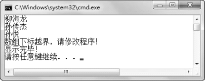

## 1.2  异常处理

 

&emsp;&emsp;所谓异常处理，就是发生异常之后，程序员要求程序该如何操作。

### 1.2.1  基本异常处理  

&emsp;&emsp;Java对异常的处理采取的是抛出、捕获的机制，即由一段可能抛出异常的程序抛出异常（也可能正常执行，不抛出异常），在这段程序外有专门的异常处理程序进行处理，针对抛出的不同类型的异常捕获后进行处理，这就是Java异常处理机制。Java异常处理机制的语法形式如下：

```

try{

	//可能抛出异常的语句块

}catch(SomeException1 e)// SomeException1特指某些异常，非Java中具体异常，下同

{

    //当捕获到SomeException1类型的异常时执行的语句块

} catch(SomeException2 e)

{

    //当捕获到SomeException2类型的异常时执行的语句块

}finally{

    //无论是否发生异常都会执行的代码

}
```


&emsp;&emsp;接下来还是先从程序开始，看看如何编写异常处理程序。


```
public class TestEx5

{

    public static void main(String[] args) 

    {

        try{

            String teachers[]={"柳海龙","孙传杰","孙悦"};

            for(int i = 0;i < 4;i++){

                System.out.println(teachers[i]);

            }

        }catch(Exception e)

        {

            System.out.println("数组下标越界，请修改程序！");

        }

        System.out.println("显示完毕！");

    }

}
```


&emsp;&emsp;该程序中，将可能抛出异常的代码放在了try语句块里，使用catch语句对所有异常（因为异常类型是Exception）进行捕获。如发生异常则输出“数组下标越界，请修改程序！”并且不退出程序，继续执行异常后面的代码，程序运行结果如图1.6所示。


<p align="center"></p>   
<p align="center">图1.6  try...catch...异常结构</p>   


&emsp;&emsp;如果try语句块中的代码不抛出异常，则执行完毕try语句块，catch语句块中的代码不被执行；如果try语句块抛出异常，则try语句块中发生异常后的代码将不再被执行，而由相应的catch语句进行捕获，catch语句块中的代码将会被执行。这里相应的catch语句是指，catch语句后面捕获异常声明的类型必须与try语句抛出异常的类型一致，或者是抛出异常类型的父类。

### 1.2.2  多个catch块  

&emsp;&emsp;将上面的程序做如下修改：

&emsp;&emsp;（1）修改for循环的第二个表达式，由“i < 4”改成“i < teachers.length”，使该段程序不会抛出数组下标越界异常；

&emsp;&emsp;（2）将“给孩子们分苹果”的程序代码加入到本程序的try语句块中。

&emsp;&emsp;具体代码如下，编译、运行，输入苹果数为8，孩子数为0，观察程序运行结果，如图1.7所示。


```
import java.util.Scanner;

public class TestEx6

{

    public static void main(String[] args) 

    {

        try{

            String teachers[]={"柳海龙","孙传杰","孙悦"};

            for(int i = 0;i < teachers.length;i++){

                System.out.println(teachers[i]);

            }                                  

            int appleNum = 0;        //苹果数

            int stuNum = 0;            //学生数

            System.out.println("***现在给孩子们分苹果***");

            Scanner input = new Scanner(System.in);

            System.out.print("请输入桌子上有几个苹果：");

            appleNum = input.nextInt();

            System.out.print("请输入班上有几个孩子：");

            stuNum = input.nextInt();

            System.out.println("班上每个孩子分得多少苹果：" + appleNum/stuNum);

            System.out.println("孩子们非常开心！");

        }catch(Exception e)

        {

            System.out.println("数组下标越界，请修改程序！");

        }

        System.out.println("显示完毕！");

    }

}
```


<p align="center"></p>   
<p align="center">图1.7  异常处理中的问题</p>   


&emsp;&emsp;仔细观察程序运行结果会发现，程序中明明抛出的是除数为0的算数异常，但显示的却是“数组下标越界，请修改程序！”的内容。出现这个问题的原因是，该程序catch语句后面捕获的是Exception类型的异常，即捕获所有类型的异常，包括除数为0的算数异常，并在捕获后执行显示“数组下标越界，请修改程序！”的代码。接下来修改上面的代码，思路为在catch语句后，针对不同类型的异常，执行不同的异常处理程序，具体代码如下：


```
import java.util.Scanner;

public class TestEx7

{

    public static void main(String[] args) 

    {

        try{

            String teachers[]={"柳海龙","孙传杰","孙悦"};

            for(int i = 0;i < teachers.length;i++){       //可以将循环次数改回4，再次运行

                System.out.println(teachers[i]);

            }

            //省略“给孩子们分苹果”程序的代码

        }catch(ArrayIndexOutOfBoundsException e)  //捕获数组下标越界异常

        {

            System.out.println("数组下标越界，请修改程序！");

        }catch(ArithmeticException e)                        //捕获算数异常

        {

            System.out.println("算数异常，请检查程序！");

        }

        System.out.println("程序执行完毕！");

    }

}
```


&emsp;&emsp;编译、运行程序，依然输入苹果数为8，孩子数为0，显示“算数异常，请检查程序！”，如图1.8所示。


<p align="center"></p>   
<p align="center">图1.8  异常处理中多个catch语句一</p>   


&emsp;&emsp;将for循环中“i < teachers.length”改回“i < 4”，再次运行程序，显示“数组下标越界，请修改程序！”，如图1.9所示。这样处理的好处是，try语句块可能抛出不同类型的异常，catch语句根据异常类型的不同分别进行捕获，执行不同的异常处理程序，使异常的处理更加合理。


<p align="center"></p>   
<p align="center">图1.9  异常处理中多个catch语句二</p>   


### 1.2.3  finally语句  

&emsp;&emsp;接下来的案例是一个客户/服务器程序，其中使用的技术之前没有学习过，但案例中已经进行了注释，需要大家能够读懂并理解含义。在以后的学习、工作中，不是所有的技术我们之前都系统学习过，肯定会碰到新技术、新问题，这就需要我们一边学一边掌握。


```
import java.net.*;                                                                //导入Java网络包

import java.io.*;                                                        //导入I/O包

public class TestEx8

{

    //声明服务器端套接字对象

    public static ServerSocket ss = null; 

    //暂不理会throws IOException代码的含义，之后的课程会详细介绍

    public static void main(String[] args) throws IOException

    {

        try {

            //实例化服务器端套接字，服务器套接字等待请求通过网络传入

            ss = new ServerSocket(5678);        //其中5678为端口号

            //侦听并接受此套接字的连接

            Socket socket = ss.accept();

            //省略其他代码

            //当发生某种I/O异常时，抛出IOException异常

        }catch (IOException e) {

            //关闭此套接字

            ss.close();

            //省略其他代码

        }

        //省略其他代码

    }

}
```


&emsp;&emsp;阅读程序，在try语句块中实例化出一个服务器端套接字并进行了处理，如果try语句块中出现IOException异常，则catch语句块进行捕获和处理，关闭这个服务器套接字，并执行其他操作。但如果程序没有抛出IOException异常，正常执行，则关闭服务器端套接字的代码将不会执行，这个套接字不会被关闭，而是继续占用系统资源，这并不是程序开发人员希望的。接下来使用finally语句块，保证无论是否发生异常，finally语句块中的代码总被执行，具体代码如下：


```
import java.net.*;

import java.io.*;

public class TestEx9

{

    public static ServerSocket ss = null;

    public static void main(String[] args) throws IOException

    {

        try {

            ss = new ServerSocket(5678); 

            Socket socket = ss.accept();

            //省略其他代码

        }catch (IOException e) {

            //省略其他代码

        }finally{

            //关闭此套接字

            ss.close();

        }

        //省略其他代码

    }

}
```


&emsp;&emsp;使用finally语句块，保证了不论try语句块中是否出现异常，finally语句块中的代码都会被执行。本例中服务器端套接字ss对象都会被关闭。

&emsp;&emsp;在try…catch…finally异常处理结构中，try语句块是必须的，catch和finally语句块均为可选，但两个语句块中至少出现一个。

&emsp;&emsp;也许有人会有这样的疑问，如果在try语句块中或者catch语句块中存在return语句，finally语句块中的代码还会执行吗？不是说return语句的作用是将结果返回给调用者，而不再执行return语句后面的代码吗！Java异常处理机制对这个问题的处理是，当try或catch语句块中有return语句时，执行try或catch语句块中return语句之前的代码，再执行finally语句块中的代码，之后再返回。所以，即使在try或catch语句块中有return语句，finally语句块中的代码仍然会被执行。

&emsp;&emsp;在异常处理结构中，finally语句块不执行的唯一一种情况就是在catch语句中出现System.exit(1)的代码，则直接退出JVM，finally语句块不再执行。接下来通过修改数组下标越界的案例来进行一下验证，具体代码如下：


```
public class TestEx10

{

    public static void main(String[] args) 

    {

        try{

            String teachers[]={"柳海龙","孙传杰","孙悦"};

            for(int i = 0;i < 4;i++){

                System.out.println(teachers[i]);

        	}

        }catch(Exception e)

        {

            System.out.println("数组下标越界，请修改程序！");

            //return;                        // finally语句块仍然执行             

            //System.exit(1);           //直接退出JVM，finally语句块不再执行

        }finally{

            System.out.println("显示完毕！");

        }

    }

}
```


&emsp;&emsp;编译、运行该程序，运行结果如图1.10所示。


<p align="center"></p>   
<p align="center">图1.10  finally语句块的使用一</p>   


&emsp;&emsp;删除return;语句前的“//”，编译、运行该程序，发现finally语句块中的代码仍然会被执行，显示出“显示完毕！”的内容，运行结果如图1.11所示。


<p align="center"></p>   
<p align="center">图1.11  finally语句块的使用二</p>   


&emsp;&emsp;注释掉return;语句，删除System.exit(1);语句前的“//”，编译、运行该程序，发现直接退出JVM，finally语句块中的代码不再被执行，运行结果如图1.12所示。


<p align="center"></p>   
<p align="center">图1.12  finally语句块的使用三</p>   


 


