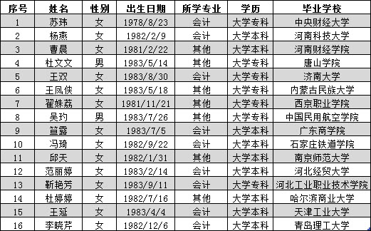
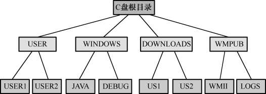
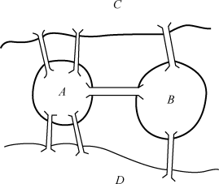
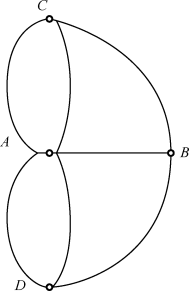

## 2.1  数据逻辑结构

 

&emsp;&emsp;数据结构从大的方向上分，可以分为逻辑结构和存储结构。逻辑结构还可以分为以下四类。

- 集合：数据元素间没有任何关系。

- 线性结构：数据元素间有线性关系。所谓线性关系是指除第一个元素外，其他元素有且只有一个前驱，除最后一个元素外，其他元素有且只有一个后继。

- 树结构：数据元素间有层状关系。

- 图结构：数据元素间有网状关系。

&emsp;&emsp;集合在程序开发中使用得非常广泛，将会在第3章详细介绍，本章仅介绍后面三种逻辑结构，其中重点介绍线性结构。

### 2.1.1  数据基本概念  

&emsp;&emsp;在介绍数据的逻辑结构之前，应先了解一下有关数据的基本概念。

- 数据

&emsp;&emsp;在计算机系统中，各种字母和数字符号的组合、语音、图形、图像等统称为数据。数据又指所有能输入到计算机并被计算机程序处理的符号的总称，是用于输入计算机进行处理，具有一定意义的数字、字母、符号和模拟量等的通称。  

&emsp;&emsp;数据按性质进行分类，可以分为：  

&emsp;&emsp;（1）定位的，如GPS系统定位的经纬度数据。  

&emsp;&emsp;（2）定性的，如表示事物本性的数据，例如桥梁、沙漠、火车、飞机等。  

&emsp;&emsp;（3）定量的，如反映事物数量特征的数据，如长度、面积、体积等几何量或重量、速度等物理量。  

&emsp;&emsp;（4）定时的，反映事物时间特性的数据，如年、月、日、时、分、秒等。  

- 数据元素  

&emsp;&emsp;数据元素是数据的基本单位，在计算机程序中通常作为一个整体进行考虑和处理。有时，一个数据元素可由若干个数据项组成，例如，一本书的书目信息为一个数据元素，而书目信息的每一项（如书名、作者名等）为一个数据项。  

&emsp;&emsp;数据项是具有独立含义的最小单位，是数据元的一个具体值，是数据记录中最基本的、不可分的有名数据单位。  

### 2.1.2  线性结构  

&emsp;&emsp;线性结构是*N*个数据元素的有序集合，这个集合中必存在第一个元素和最后一个元素，除第一个元素外，其他元素都有唯一的前一个元素，除最后一个元素外，其他元素都有唯一的下一个元素。之前我们学过的数组就是一个典型的线性结构，常用的线性结构有线性表、栈和队列等。

&emsp;&emsp;例如，某学校有一个学生信息表，表里包括序号、姓名、性别和出生日期等方面信息，如图2.1所示。其中一行表示一条数据记录，即表示某个学生的信息，一列代表一个属性，表示该记录中某一方面的属性。每个学生按序号有先后次序，学生之间形成一种线性关系，这种数据结构称为线性关系。

  

图2.1  线性结构—学生信息表
  

&emsp;&emsp;对线性结构的主要操作有查找线性结构中某个信息、修改线性结构中某个信息、在固定的位置插入和删除相应的信息等，即查询、插入、删除、修改等相关操作。

### 2.1.3  树结构  

&emsp;&emsp;树结构是一种重要的非线性数据结构，它是数据元素（在树中称为节点）按分支关系组织起来的结构，像自然界中的树那样。除根节点外，每个节点都有唯一的父节点；除叶子节点（没有子节点的节点）外，每个节点允许有若干个子节点。

&emsp;&emsp;树结构是用来表示层次关系的逻辑结构。树结构在客观世界中广泛存在，例如公司的组织结构图就是一种典型的树结构。树在计算机领域中也得到了广泛应用，操作系统中文件系统的组织形式就是树结构。

&emsp;&emsp;一棵树是由N个元素组成的有限集合，其中每个元素都称为节点（Node）。有一个特定的节点，称为根节点；除根节点外，其余节点被分成若干个互不相交的有限集合，而每个子集又都是一棵树，称为原树的子树。

&emsp;&emsp;操作系统中文件系统（以C盘为例）的目录结构如图2.2所示，C盘根目录下有四个子目录（USER、WINDOWS、DOWNLOADS、WMPUB），每个子目录下面又设有两个子目录，它们之间形成了一种层次关系，这就是一种树结构（也称为层次结构），每个目录都是该树结构中的节点，节点之间形成了一对多的关系。

  

图2.2  树结构—C盘目录结构
  

&emsp;&emsp;对树结构可以进行的操作主要有：查找节点、节点信息的修改、节点的插入和删除等。

&emsp;&emsp;树结构的基本概念包括：

- 度：宽度。简单地说，就是节点的分支数。以组成该树各节点中最大的度作为该树的度。树中度为0的节点称为叶节点，树中度不为0的节点称为分支节点，除根节点外的分支节点统称为内部节点。

- 层次：根节点的层次为1，其他节点的层次等于它的父节点的层次数加1。

- 深度：组成该树各节点的最大层次。

- 路径：对于一棵树中的任意两个不同的节点，从一个节点出发，沿着一个个树枝到达另一个节点，它们之间存在着一条路径。可以用路径所经过的节点序列表示路径，路径的长度等于路径上的节点个数减1。

- 森林：指若干棵互不相交的树的集合。

### 2.1.4  图结构  

&emsp;&emsp;图结构是一种复杂的数据结构，数据元素间的关系是任意的。其他数据结构（如树结构、线性结构等）的数据元素之间都有明确的条件限制，而图形结构中任意两个数据元素间均可相关联。

&emsp;&emsp;先来看一个著名的案例—哥尼斯堡七桥问题。在18世纪的东普鲁士的哥尼斯堡城，有条横贯全城的普雷格尔河和两个岛屿，在河的两岸与岛屿之间架设了7座桥，把它们连接起来，如图2.3所示。将图2.3所示的问题抽象成一个数学问题，就形成一个如图2.4所示的图结构。

  

图2.3  哥尼斯堡七桥问题
  

  

图2.4  图结构—哥尼斯堡七桥问题
  

​                                

&emsp;&emsp;由图2.4可以看出，*A*、*B*、*C*、*D*四个节点之间都可以产生联系，即多对多的关系，这就是数据结构中的图结构（也称为网状结构）。

&emsp;&emsp;对图结构中可以进行的操作有：检索顶点、查找某顶点到其他顶点之间的路径，求最短距离，求关键路径等。

&emsp;&emsp;总结一下，根据数据结构中相关元素之间的不同关系，可以将数据结构分为集合结构、线性结构、树结构和图结构，四者之间的差异如图2.5所示。

  

图2.5  四种数据逻辑结构示意图
  

