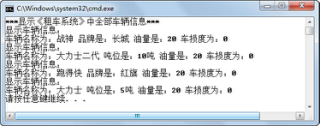

## 3.13  泛型

 

&emsp;&emsp;在之前使用集合的时候，装入集合的各种类型的对象都被当作Object对待，失去了自己的类型，而从集合中取出对象时需要进行类型转换，效率低下且容易出错。如何解决这个问题？可以使用泛型解决这个问题。

&emsp;&emsp;接下来以“租车系统”的代码为例，通过泛型（即定义集合时同时定义集合中元素的类型）的方式，解决程序可读性以及强制类型转换时的稳定性问题。


```
import java.util.*;

import com.bd.zuche.*;

class TestZuChe2 

{

​         public static void main(String[] args) 

​         {

​                  //使用泛型保证集合里的数据元素都是Vehicle类及其子类

​                  List<Vehicle> vehAL = new ArrayList<Vehicle>();

​                  Vehicle c1 = new Car("战神","长城");

​                  Vehicle c2 = new Car("跑得快","红旗");

​                  Vehicle t1 = new Truck("大力士","5吨");

​                  Vehicle t2 = new Truck("大力士二代","10吨");

​                  vehAL.add(c1);

​                  vehAL.add(c2);

​                  vehAL.add(t1);

​                  vehAL.add(1,t2);                            //在集合索引为1处添加t2

​                  //vehAL.add("大力士三代");                  //编译错误，添加的不是Vehiclel类型

​                  System.out.println("***显示“租车系统”中全部车辆信息***");

​                  //使用增强for循环遍历时，获取的已经是Vehicle对象

​                  for(Vehicle obj:vehAL){

​                           obj.show();

​                  }

​         }

}
```


&emsp;&emsp;List<Vehicle> vehAL = new ArrayList<Vehicle>();这句代码的作用是使用泛型创建ArrayList集合vehAL，且集合中元素必须是Vehicle类及其子类。如果向这个集合中添加其他的类型，编译器会报错。当从集合中获取对象时，也是直接获取了Vehicle类的对象，不需要再进行强制类型转换。程序运行结果如图3.14所示。


<p align="center"></p>  
<p align="center">图3.14  泛型的使用</p>  


