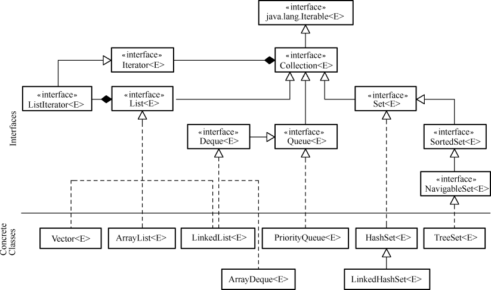

## 3.1  集合框架
 

&emsp;&emsp;集合，也称为容器，它可以将一系列元素组合成一个单元，用于存储、提取、管理数据。JDK提供的集合API都包含在java.util包内。

&emsp;&emsp;Java集合的框架主要分两大部分，一部分实现了Collection接口，该接口定义了存取一组对象的方法，其子接口Set和List分别定义了存取方式；另一部分是Map接口，该接口定义了存储一组“键（key）值（value）”映射对的方法。

### 3.1.1  集合引入  

&emsp;&emsp;在介绍面向对象编程课程时，我们一直使用的“租车系统”如果想存放多个轿车的信息，该如何实现呢？以大家现有的知识储备，使用数组解决这个问题是最合理的方式。但是使用数组存放“租车系统”中多个轿车的信息，也会存在很多问题。

&emsp;&emsp;首先，Java语言中的数组长度是固定的，一旦创建出指定长度的数组以后，就给内存分配了相应的存储空间。这样就会给程序员造成很大的困惑，如果数组长度设置小了，不能满足程序需求，如果数组长度设置大了，又会造成大量的空间浪费。

&emsp;&emsp;其次，如果使用长度为20的轿车对象数组来存放轿车的信息，但是实际上只存放了8辆轿车的信息，这时要获取这个数组中实际存放了多少辆轿车信息的数字，就不是数组这个数据结构自己能解决的问题了。数组只提供了length属性来获取数组的长度，而不能获取数组中实际存放有用信息的个数。

&emsp;&emsp;最后，数组在内存空间中是连续存放的，这样如果在数组中删除一个元素，为了保持数组内数据元素的有序性，之后的数组元素全部要前移一位，这样非常消耗系统资源。

&emsp;&emsp;通过上面的分析大家可以看出，使用数组虽然可以实现之前的目的，但会有诸多的麻烦。为了解决这个问题，Java语言给我们提供了集合这种类型。集合是一种逻辑结构，提供了更多的方法，让使用者更加方便。针对不同的需求，Java提供了不同的集合，解决各类问题。

### 3.1.2  Collection接口框架  

&emsp;&emsp;Collection是最基本的集合接口，一个Collection代表一组Object，每个Object即为Collection中的元素。一些Collection接口的实现类允许有重复的元素，而另一些则不允许；一些 Collection 是有序的，而另一些则是无序的。

&emsp;&emsp;JDK不提供Collection接口的任何直接实现类，而是提供了更具体的子接口（如Set接口和List接口）实现。这些Set和 List子接口继承Collection接口的方法，从而保证Collection接口具有更广泛的普遍性。Collection接口框架如图3.1所示。

  

图3.1  Collection接口框架
  

&emsp;&emsp;从图3.1中可以看出，Collection接口继承自Iterable接口，因为Iterable接口允许对象成为 foreach语句的目标，所以所有集合类都可以成为JDK1.5的新特性，增强for循环的目标。

&emsp;&emsp;Collection接口主要有三个子接口，分别是List接口、Set接口和Queue接口，下面简要介绍这三个接口。

- List接口

&emsp;&emsp;实现List接口的集合是一个有序的 Collection序列。操作此接口的用户可以对这个序列中每个元素的位置进行精确控制，用户可以根据元素的索引访问元素。List接口中的元素是可以重复的。

- Set接口

&emsp;&emsp;实现Set接口的集合是一个无序的 Collection序列，该序列中的元素不可重复。因为Set接口是无序的，所以不可以通过索引访问Set接口中的数据元素。

- Queue接口

&emsp;&emsp;Queue接口用于在处理元素前保存元素的Collection序列。除了具有Collection接口基本的操作外，Queue接口还提供了其他的插入、提取和检查等操作。

### 3.1.3  Map接口框架  

&emsp;&emsp;Map接口定义了存储和操作一组“键（key）值（value）”映射对的方法。

&emsp;&emsp;Map接口和Collection接口的本质区别在于，Collection接口里存放的是一个个对象，而Map接口里存放的是一系列的键值对。Map接口集合中的key不要求有序，对于一个集合里的映射对而言，不能包含重复的键，每个键最多只能映射到一个值。Map接口框架如图3.2所示。

  

图3.2  Map接口框架
  

&emsp;&emsp;从图3.2中可以看出，HashMap和Hashtable是实现Map接口的集合类，这两个类十分类似，在后面的章节中将会详细介绍HashMap。

 
