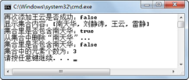
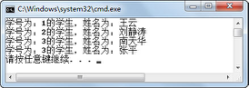

## 3.2  Set接口
 

&emsp;&emsp;Set接口是Collection接口的子接口，除了拥有Collection接口的方法外，Set接口没有提供额外的方法。

### 3.2.1  Set接口方法  

&emsp;&emsp;下面列出了Set接口继承自Collection接口的主要方法。

- boolean add(Object obj)

&emsp;&emsp;向集合中添加一个数据元素，该数据元素不能和集合中现有数据元素重复。

&emsp;&emsp;Set集合采用对象的equals()方法比较两个对象是否相等，判断某个对象是否已经存在于集合中。当向集合中添加一个对象时，HashSet会调用对象的hashCode()方法来获得哈希码，然后根据这个哈希码进一步计算出对象在集合中的存放位置。

- void clear()  

&emsp;&emsp;移除此集合中的所有数据元素，即将集合清空。  

- boolean contains(Object obj)  

&emsp;&emsp;判断此集合中是否包含该数据元素，如果包含，则返回true。

- boolean isEmpty()  

&emsp;&emsp;判断集合是否为空，为空则返回true。

- Iterator iterator()  


&emsp;&emsp;返回一个Iterator对象，可用它来遍历集合中的数据元素。

- boolean remove(Object obj)  


&emsp;&emsp;如果此集合中包含该数据元素，则将其删除，并返回true。

- int size()  


&emsp;&emsp;返回集合中数据元素的个数，注意与数组、字符串获取长度的方法的区别。

- Object[] toArray()  


&emsp;&emsp;返回一个数组，该数组包含集合中的所有数据元素。


### 3.2.2  HashSet使用  

&emsp;&emsp;Set接口主要有两个实现类HashSet和TreeSet，HashSet类有一个子类LinkedHashSet，它不仅实现了哈希算法，而且采用了链表结构。接下来通过一个案例来说明HashSet类的使用。

```
import java.util.*;                                    //导入包

public class TestSet 

{

public static void main(String[] args) 

{

//创建一个HashSet对象，存放学生姓名信息

​                  Set nameSet = new HashSet();

​                  nameSet.add("王云");

​                  nameSet.add("刘静涛");

​                  nameSet.add("南天华");

​                  nameSet.add("雷静");

​                  nameSet.add("王云");           //增加已有的数据元素

​                  System.out.println("再次添加王云是否成功：" + nameSet.add("王云"));

​                  System.out.println("显示集合内容：" + nameSet);

​                  System.out.println("集合里是否包含南天华：" + nameSet.contains("南天华"));

​                  System.out.println("从集合中删除\"南天华\"...");

​                  nameSet.remove("南天华");

​                  System.out.println("集合里是否包含南天华：" + nameSet.contains("南天华"));

​                  System.out.println("集合中的元素个数为：" + nameSet.size());

}

}
```


&emsp;&emsp;编译、运行程序，程序运行结果如图3.3所示。从运行结果中可以看出，当向集合中增加一个已有（通过equals()方法判断）的数据元素时，没有添加成功。需要注意的是，可以通过add()方法的返回值判断是否添加成功，如果不获取这个返回值的话，Java系统并不提示没有添加成功。


<p align="center"></p>  
<p align="center">图3.3  HashSet的使用</p>  


### 3.2.3  TreeSet使用  

&emsp;&emsp;TreeSet类在实现了Set接口的同时，也实现了SortedSet接口，是一个具有排序功能Set接口类。本小节将介绍TreeSet类的使用，同时也会涉及Java如何实现对象间的排序功能，希望大家能深刻体会。

&emsp;&emsp;TreeSet集合中的元素按照升序排列，默认是按照自然升序排列，也就是说TreeSet集合中的对象需要实现Comparable接口。 

&emsp;&emsp;接下来看一段非常简单的程序，编译运行，其运行结果如图3.4所示。


```
import java.util.*;

public class TestTreeSet

{

public static void main(String[] args)

​         {

Set ts = new TreeSet();

​                  ts.add("王云");

​                  ts.add("刘静涛");

​                  ts.add("南天华");

​                  System.out.println(ts);

​         }

}  
```


<p align="center"></p>  
<p align="center">图3.4  TreeSet的使用</p>  


&emsp;&emsp;从运行结果可以看出，TreeSet集合ts里面的元素不是毫无规律的排序，而是按照自然升序进行了排序。这是因为TreeSet集合中的元素是String类，而String类实现了Comparable接口，默认按自然顺序排序。

### 3.2.4  Comparable接口  

&emsp;&emsp;如果程序员想定义自己的排序方式，方法也很简单，就是要让加入TreeSet集合中的对象所属的类实现Comparable接口，通过实现compareTo(Object o)方法，达到排序的目的。

&emsp;&emsp;假设有这样的需求，学生对象有两个属性，分别是学号和姓名。希望将这些学生对象加入TreeSet集合后，按照学号大小从小到大进行排序，学号相同的再按照姓名自然排序。让我们来看学生类的代码（实现Comparable接口）：


```
class Student implements Comparable {

int stuNum = -1;                   //学生学号

​         String stuName = "";             //学生姓名

​         Student(String name, int num) {

this.stuNum = num;

​                  this.stuName = name;

​         }

​         //返回该对象的字符串表示，利于输出

​         public String toString() {

​                  return "学号为：" + stuNum + "的学生，姓名为：" + stuName;

​         }

​         //实现Comparable的compareTo方法

​         public int compareTo(Object o) {

​                  Student input = (Student) o;

​                  //此学生对象的学号和指定学生对象的学号比较

​                  //此学生对象学号若大则res为1，若小则res为-1，相同的话res = 0

​                  int res = stuNum > input.stuNum ? 1 : (stuNum == input.stuNum ? 0 : -1);

​                  //若学号相同，则按照String类自然排序比较学生姓名

​                  if (res == 0) {

res = stuName.compareTo(input.stuName);

​                  }

​                  return res;

​         }

}

```

&emsp;&emsp;其中，int compareTo(Object o)方法是用此对象和指定对象进行比较，如果该对象小于、等于或大于指定对象，则分别返回负整数、零或正整数。编写测试程序，具体代码如下。程序运行结果如图3.5所示。


```
public class TestTreeSet2{

public static void main(String[] args) {

//用有序的TreeSet存储学生对象

​                  Set stuTS = new TreeSet();

​                  stuTS.add(new Student("王云",1));

​                  stuTS.add(new Student("南天华",3));     

​                  stuTS.add(new Student("刘静涛",2));

​                  stuTS.add(new Student("张平",3));

​                  //使用迭代器循环输出

​                  Iterator it = stuTS.iterator();

​                  while (it.hasNext()) {

​                           System.out.println(it.next());

​                  }

​         }

}

```


<p align="center"></p>  
<p align="center">图3.5  Comparable接口的使用</p>  


