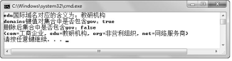

## 3.6  Map接口
 

&emsp;&emsp;Map接口定义了存储“键（key）值（value）”映射对的方法。

### 3.6.1  HashMap使用  

&emsp;&emsp;HashMap是Map接口的一个常用实现类，下面通过一个案例简要介绍HashMap的使用。

&emsp;&emsp;我们知道，国际域名是使用最早也是使用最广泛的域名，例如表示工商企业的.com，表示网络提供商的.net，表示非营利组织的.org等。现在需要建立域名和含义之间的键值映射，例如com映射工商企业，org映射非营利组织，可以根据com查到工商企业，可以通过删除org删除对应的非营利组织，这样的想法就可以通过HashMap来实现，具体代码如下：


```
import java.util.*;

public class TestHashMap

{

​         public static void main(String[] args) 

​         {

//使用HashMap存储域名和含义键值对的集合

​                  Map domains = new HashMap();

​                  domains.put("com","工商企业");

​                  domains.put("net","网络服务商");

​                  domains.put("org","非营利组织");

​                  domains.put("edu","教研机构");

​                  domains.put("gov","政府部门");

​                  //通过键获取值

​                  String op = (String)domains.get("edu");

​                  System.out.println("edu国际域名对应的含义为：" + op);

​                  //判断是否包含某个键

​                  System.out.println("domains键值对集合中是否包含gov：" + domains.containsKey("gov"));

​                  //删除键值对

​                  domains.remove("gov");

​                  System.out.println("删除后集合中是否包含gov：" + domains.containsKey("gov"));

​                  //输出全部键值对

​                  System.out.println(domains);

​         }

}
```


&emsp;&emsp;编译、运行程序，运行结果如图3.12所示。


<p align="center"></p>  
<p align="center">图3.12  HashMap的使用</p>  


### 3.6.2  Map接口方法  

&emsp;&emsp;上面通过一个简单的例子，让大家对Map接口的使用有了直接的认识，下面总结Map接口的常用方法如下。

- Object put(Object key,Object value)

&emsp;&emsp;将指定键值对添加到Map集合中，如果此Map集合以前包含一个该键的键值对，则用指定值替换旧值。

- Object get(Object key)

&emsp;&emsp;返回指定键所对应的值，如果此Map集合中不包含该键，则返回null。

- Object remove(Object key)

&emsp;&emsp;如果存在指定键的键值对，则将该键值对从此Map集合中移除。

- Set keySet()

&emsp;&emsp;返回此 Map 集合中包含的键的 Set集合。在上面的程序最后添加下面的语句，System.out. println(domains.keySet());，则会输出[com, edu, org, net]。

- Collection values() 

&emsp;&emsp;返回此Map集合中包含的值的 Collection集合。在上面的程序最后添加下面的语句，System.out.println(domains.values());，则会输出[工商企业，教研机构，非营利组织，网络服务商]。

- boolean containsKey(Object key)

&emsp;&emsp;如果此Map集合包含指定键的键值对，则返回true。

- boolean containsValue(Object value)

&emsp;&emsp;如果此Map集合将一个或多个键对应到指定值，则返回true。

- int size()

&emsp;&emsp;返回此Map集合的键值对的个数。


