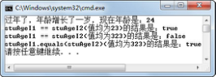

## 3.7  自动拆箱和装箱
 

&emsp;&emsp;在本章中，已经介绍了JDK1.5的一个新特性—增强for循环。接下来，将继续介绍另外两个JDK1.5的新特性，自动拆箱和装箱、泛型。其中泛型是下一节介绍的内容，本节将介绍自动拆箱和装箱。

### 3.7.1  自动拆箱和装箱概念  

&emsp;&emsp;自动拆箱和装箱，其目的是方便基本数据类型和其对应的包装类型之间的转换。在此可以直接把一个基本数据类型的值赋给其包装类型（装箱），反之亦然（拆箱），中间的过程由编译器自动完成。

&emsp;&emsp;编译器对这个过程也只是做了简单的处理，通过包装类的valueOf()方法对基本数据类型进行包装，通过包装类的类似intValue()方法得到其基本数据类型。例如下面的代码：


```
Integer stuAgeI = 23;

int stuAge = stuAgeI;
```


编译器将其自动变换为：


```
Integer stuAgeI = Integer.valueOf(23);

int stuAge = stuAgeI.intValue();
```


### 3.7.2  自动拆箱和装箱使用  

&emsp;&emsp;自动拆箱和装箱看起来非常简单，也很容易理解，但是在使用过程中，尤其是在自动装箱后，在两个对象之间使用“==”运算符进行比较时，其结果尤其需要注意。

&emsp;&emsp;接下来看下面的代码：


```
public class TestBox 

{

​         public static void main(String[] args) 

​         {

​                  Integer stuAgeI1 = 23;

​                  System.out.println("过年了，年龄增长了一岁，现在年龄是：" + (stuAgeI1 + 1)); 

​                  Integer stuAgeI2 = 23; 

​                  System.out.println("stuAgeI1 == stuAgeI2(值均为23)的结果是：" + (stuAgeI1 == stuAgeI2)); 

​                  stuAgeI1 = 323;

​                  stuAgeI2 = 323;  

​                  System.out.println("stuAgeI1 == stuAgeI2(值均为323)的结果是：" + (stuAgeI1 == stuAgeI2));          

​                  System.out.println("stuAgeI1.equals(stuAgeI2)(值均为323)的结果是：" 

​                           \+ (stuAgeI1.equals(stuAgeI2))); 

​         }

}

```

&emsp;&emsp;程序运行结果如图3.13所示。


<p align="center"></p>  
<p align="center">图3.13  自动拆箱和装箱</p>  


&emsp;&emsp;看到上面的运行结果，大家可能会很困惑，为什么当stuAgeI1和stuAgeI2这两个对象中存的值均为23时，使用“==”进行比较，其结果为true，而当这两个对象的值为323时，其结果却为false了！

&emsp;&emsp;这是因为这些包装类的valueOf()方法，对部分经常使用的数据采用缓存技术，也就是在未使用的时候，这些对象就创建并缓存着，需要使用的时候不需要新创建该对象，直接从缓存中获取即可，从而提高性能。例如Byte、Integer和Long这些包装类都缓存了数值在-128～+127之间的对象，自动装箱的时候，如果对象值在此范围之内，则直接返回缓存的对象，只有在缓存中没有的时候再去创建一个对象。

&emsp;&emsp;当第一次比较stuAgeI1和stuAgeI2这两个对象时，因为其值在-128～+127之间，所以这两个对象都是直接返回的缓存对象，使用“==”比较时结果为true。而第二次比较stuAgeI1和stuAgeI2这两个对象时，其值超出了-128～+127的范围，需要通过new方法创建两个新的包装类对象，所以再使用“==”比较时结果为false。

 
