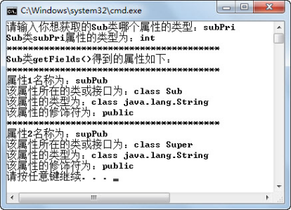
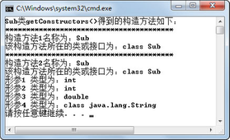

## 5.4  获取类信息

 

&emsp;&emsp;通过介绍Class类的常用方法，可以已经发现，Class类的一些方法会返回Method、Field、Constructor这些类的对象，接下来将使用这些对象获取Class类的方法、属性、构造方法方面的信息。

### 5.4.1  获取方法  

&emsp;&emsp;通过Class类的getMethods()方法、getDeclaredMethods()方法、getMethod(String name, Class[] args)方法和getDeclaredMethod(String name, Class[] args)等方法，程序员可以获得对应类的特定方法组或方法，返回值为Method对象数组或Method对象。接下来，通过一个案例来演示如何详细获取一个类的所有方法的信息（方法名、参数列表和异常列表）。


```
import java.lang.reflect.*;

public class TestMethod{

public static void main(String args[]) {

try {

Class c = Class.forName("org.w3c.dom.NodeList");

//返回Method对象数组，存放该类或接口的所有方法（不含继承的）

Method mlist[] = c.getDeclaredMethods();

System.out.println("NodeList类getDeclaredMethods()得到的方法如下：");

//遍历所有方法

for (int i = 0; i < mlist.length; i++){

System.out.println("****************************************");

Method m = mlist[i]; 

System.out.println("方法" + (i+1) + "名称为：" + m.getName());//得到方法名

System.out.println("该方法所在的类或接口为：" + m.getDeclaringClass());

//返回Class对象数组，表示Method对象所表示的方法的形参类型

Class ptl[] = m.getParameterTypes();

for (int j = 0; j < ptl.length; j++)

System.out.println("形参" + (j+1) + " 类型为：" + ptl[j]);

//返回Class对象数组，表示Method对象所表示的方法的异常列表

Class etl[] = m.getExceptionTypes();

for (int j = 0; j < etl.length; j++)

System.out.println("异常" + (j+1) + " 类型为：" + etl[j]);

System.out.println("返回值类型为：" + m.getReturnType());

}

} catch (Exception e) {

e.printStackTrace();

}       

}

}
```


&emsp;&emsp;为了使程序输出的内容不要太多，所以选择了仅有两个方法的org.w3c.dom.NodeList接口，演示如何获取方法信息。案例中使用了Method类的getName()、getDeclaringClass()、getParameterTypes()、getExceptionTypes()、getReturnType()方法，作用分别为获得方法名称、方法所在的类或接口名，方法的参数列表，方法的异常列表以及方法的返回值类型。

&emsp;&emsp;程序运行结果如图5.4所示，因为NodeList接口的两个方法都没有必须要捕获的异常，所以程序运行结果中没有显示出异常列表的内容。


<p align="center"></p>  
<p align="center">图5.4  获取类方法详细信息</p>  


&emsp;&emsp;接下来在上面案例的基础上，说明Class类的getDeclaredMethods()方法和getMethods()方法的区别。先创建Sub和Super两个类，其中Sub是继承自Super的子类，每个类中都有四种不同访问权限的方法，具体代码如下：


```
public class Sub extends Super

{

private int subPri = 11;

int subPac = 12;

protected double subPro = 13;

public String subPub = "14";

private void subPrivate(){}

int subPackage(){return subPac;}

protected double subProtected(){return subPro;}

public String subPublic(){return subPub;}       

}

class Super

{

private int supPri = 1;

int supPac = 2;

protected double supPro = 3;

public String supPub = "4";

private void supPrivate(){}

int supPackage(){return supPac;}

protected double supProtected(){return supPro;}

public String supPublic(){return supPub;}

}
```


&emsp;&emsp;修改TestMethod类代码，将装入类从org.w3c.dom.NodeList改为Sub，运行程序，观察Sub类的Class对象调用getDeclaredMethods()方法，获得了Sub类的哪些方法。程序运行结果如图5.5所示。


<p align="center"></p>  
<p align="center">图5.5  getDeclaredMethods()方法获得的方法</p>  


&emsp;&emsp;从运行结果可以看出，Class类的getDeclaredMethods()方法获得了Class所表示的Sub类的全部私有、默认、受保护和公有的方法，但不包括继承的方法（如果Super类和Sub类在同一个Java源文件中进行编译，显示的结果会包括父类公有的方法）。若将TestMethod代码中的getDeclaredMethods()方法再改为getMethods()，则程序运行结果如图5.6所示。


<p align="center"></p>  
<p align="center">图5.6  getMethods()方法获得的方法</p>  


&emsp;&emsp;从运行结果（输出内容较多，仅截选了部分内容）可以看出，Class类的getMethods()方法获得了Class所表示的Sub类及其父类所有的公共方法。

### 5.4.2  获取属性  

&emsp;&emsp;通过上一小节的学习，已经获得Class类的方法数组，并通过操作这些方法数组里的Method对象，获取方法的详细信息。一个类除了有方法外，剩下最重要的部分应该就是属性了。接下来通过一个案例来演示如何获取Sub类的相关属性。

```

import java.lang.reflect.*;

import java.util.Scanner;

public class TestField{

public static void main(String args[]) {

try {

Class c = Class.forName("Sub");

Scanner input = new Scanner(System.in);

System.out.print("请输入你想获取Sub类的哪个属性的类型：");

String name = input.next();

//通过指定属性名获取属性对象

Field sf = c.getDeclaredField(name);

//得到属性类型

System.out.println("Sub类" + name + "属性的类型为：" + sf.getType());

System.out.println("****************************************");

//返回Field对象数组，存放该类或接口的所有属性（不含继承的）

Field flist[] = c.getDeclaredFields();

System.out.println("Sub类getDeclaredFields()得到的属性如下：");

//遍历所有属性

for (int i = 0; i < flist.length; i++){

System.out.println("****************************************");

Field f = flist[i]; 

System.out.println("属性" + (i+1) + "名称为：" + f.getName());        //得到属性名

System.out.println("该属性所在的类或接口为：" + f.getDeclaringClass());

System.out.println("该属性的类型为：" + f.getType());            //得到属性类型

//以整数形式返回由此Field对象表示的属性的Java访问权限修饰符

int m = f.getModifiers();

//使用Modifier类对表示访问权限修饰符的整数进行解码显示

System.out.println("该属性的修饰符为：" + Modifier.toString(m));

}

} catch (Exception e) {

e.printStackTrace();

}

}

}
```


&emsp;&emsp;案例中使用了Field类的getType()方法获取属性的类型，getName()方法获取属性名、getDeclaringClass()方法获取属性所在的类或接口名称，getModifiers()方法获取以整数形式返回由此Field对象表示的属性的Java访问权限修饰符（值为m），并通过Modifier.toString(m)获取Java访问权限修饰符字符串结果。

&emsp;&emsp;程序运行结果如图5.7所示。注意程序中首先使用了getDeclaredField(name)方法获取了指定属性名的属性对象。获取Sub类属性的方法是getDeclaredFields()，返回的是Sub类的全部属性（不含继承的属性）。如果想获得Sub类所有公共属性，则需要调用getFields()方法。将程序中getDeclaredFields()方法改为getFields()，再次编译运行。程序运行结果如图5.8所示。


<p align="center"></p>  
<p align="center">图5.7  getDeclaredFields()方法获得的属性</p>  


<p align="center"></p>  
<p align="center">图5.8  getFields()方法获得的属性</p>  


### 5.4.3  获取构造方法  

&emsp;&emsp;通过Class类，可以获得属性和方法，但是getDeclaredMethods()和getMethods()等获取方法的方法只能获得普通方法，不能获得类的构造方法。接下来，通过Class类的getConstructors()方法和 getDeclaredConstructors()方法，可以获得对应类的构造方法，返回值为Constructor对象数组。下面首先改造Sub类，具体代码如下：


```
public class Sub extends Super

{

public Sub(){}

public Sub(int pri,int pac,double pro,String pub)

{

this.subPri = pri;

this.subPac = pac;

this.subPro = pro;

this.subPub = pub;

}                

protected Sub(int pri,int pac,double pro){this(pri,pac,pro,"14");}

Sub(int pri,int pac)throws Exception{this(pri,pac,13.0,"14");}    

private Sub(int pri){this(pri,12,13.0,"14");}

private int subPri = 11;

int subPac = 12;

protected double subPro = 13;

public String subPub = "14";

}

class Super

{       

public Super(){}

public Super(int pri,int pac,double pro,String pub)

{

this.supPri = pri;

this.supPac = pac;

this.supPro = pro;

this.supPub = pub;

}

protected Super(int pri,int pac,double pro){this(pri,pac,pro,"4");}

Super(int pri,int pac)throws Exception{this(pri,pac,3.0,"4");}     

private Super(int pri){this(pri,2,3.0,"4");}

private int supPri = 1;

int supPac = 2;

protected double supPro = 3;

public String supPub = "4";

}
```


&emsp;&emsp;Sub类仍然继承Super类，每个类中都有一个无参构造方法和四个具有不同访问权限的有参构造方法。通过Class类获取构造方法的代码如下：


```
import java.lang.reflect.*;

public class TestConstructor{

public static void main(String args[]) {

try {

Class c = Class.forName("Sub");

//返回Constructor对象数组，存放该类或接口的所有构造方法

Constructor clist[] = c.getDeclaredConstructors();

//返回Constructor对象数组，存放该类或接口的所有公共构造方法

//Constructor clist[] = c.getConstructors();

System.out.println("Sub类getDeclaredConstructors()得到的构造方法如下：");

int i = 0;

//遍历所有构造方法

for(Constructor con:clist){

System.out.println("****************************************");

System.out.println("构造方法" + (i+1) + "名称为：" + con.getName());//得到方法名

System.out.println("该构造方法所在的类或接口为：" + con.getDeclaringClass());

//返回Class对象数组，表示Constructor对象所表示的构造方法的形参类型

Class ptl[] = con.getParameterTypes();

for (int j = 0; j < ptl.length; j++)

System.out.println("形参" + (j+1) + " 类型为：" + ptl[j]);

//返回Class对象数组，表示Constructor对象所表示的方法的异常列表

Class etl[] = con.getExceptionTypes();

for (int j = 0; j < etl.length; j++)

System.out.println("异常" + (j+1) + " 类型为：" + etl[j]);

i++;

}

} catch (Exception e) {

e.printStackTrace();

}

}

}
```


&emsp;&emsp;分别调用Sub类所属Class的getDeclaredConstructors()和getConstructors()方法，运行结果如图5.9和图5.10所示。其中getDeclaredConstructors()方法得到了Sub类里声明的全部五个构造方法，而getConstructors()方法得到了Sub类里声明的两个公有的构造方法。


<p align="center"></p>  
<p align="center">图5.9  getDeclaredConstructors()方法获得的构造方法    </p>  


<p align="center"></p>  
<p align="center">图5.10  getConstructors()方法获得的构造方法</p>  

​        


