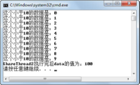

## 6.4  共享数据

&emsp;&emsp;前面看到的多线程程序中各个线程大多都是独立运行的，但在真正的应用中，程序中的多个线程通常以某种方式进行通信或共享数据。在这种情况下，必须使用同步机制来确保数值被正确地传递，并防止数据不一致。

### 6.4.1  数据不一致  

&emsp;&emsp;首先来看这样一个案例：


```
public class ShareData{

static int data = 0;

public static void main(String[] args){

ShareThread1 st1 = new ShareThread1();

ShareThread2 st2 = new ShareThread2();

new Thread(st1).start();

new Thread(st2).start();

}

//内部类，访问类中静态成员变量data

private static class ShareThread1 implements Runnable{

public void run() {

while(data < 10){

try {

Thread.sleep(1000);

System.out.println("这个小于10的数据是：" + data++);

} catch (InterruptedException e) {

e.printStackTrace();

}

}

}

}

//内部类，访问类中静态成员变量data

private static class ShareThread2 implements Runnable{

public void run() {

while(data < 100){

data++;

}

}

}

}
```


&emsp;&emsp;ShareData类中有两个内部类ShareThread1和ShareThread2，这两个内部类都共享并访问ShareData类中静态成员变量data。其中ShareThread1类的run()方法判断当data小于10时进行输出，不过在输出前通过调用sleep()方法等待1秒。而ShareThread2类的run()方法让data循环执行自加的操作，直到data不小于100时停止。

&emsp;&emsp;编译、运行程序，输出结果显示这个小于10的数据是：100，很明显，这并不是程序希望的结果。出现这样结果的原因是，当ShareThread1类的对象在判断data<10时，data的值小于10，所以能进入run()方法的while循环内。但是当进入while循环后，在输出前需要等待1秒，在这个过程中，ShareThread2类的对象通过run()方法不停地进行data自加操作，直到data=100为止。这时ShareThread1类对象再输出，其结果自然是这个小于10的数据是：100。

&emsp;&emsp;该案例说明，当一个数据被多个线程存取的时候，通过检查这个数据的值来进行判断并执行之后的操作是极不安全的。因为在判断之后，这个数据的值很可能被其他线程修改了，判断条件也可能已经不成立了，但此时已经经过了判断，之后的操作还需要继续进行。

### 6.4.2  控制共享数据  

&emsp;&emsp;上面的案例中，共享数据data被不同的线程存取，出现了数据不一致的情况。针对这种情况，Java提供了同步机制，来解决控制共享数据的问题，Java可以使用synchronized关键字确保数据在各个线程间正确共享。修改上面的案例，注意synchronized关键字的使用。


```
public class ShareData2{

static int data = 0;

//定义了一个锁对象lock

static final Object lock = new Object();

public static void main(String[] args){

ShareThread1 st1 = new ShareThread1();

ShareThread2 st2 = new ShareThread2();

new Thread(st1).start();

new Thread(st2).start();

}

private static class ShareThread1 implements Runnable{

public void run() {

//对lock对象上锁

synchronized(lock){

while(data < 10){

try {

Thread.sleep(1000);

System.out.println("这个小于10的数据是：" + data++);

} catch (InterruptedException e) {

e.printStackTrace();

}

}

}

}

}

private static class ShareThread2 implements Runnable{

public void run() {       

//对lock对象上锁

synchronized(lock){

while(data < 100){

data++;

}

System.out.println("ShareThread2执行完后data的值为：" + data);

}

}

}

}
```


&emsp;&emsp;程序中，首先定义了一个静态的成员变量lock，然后在ShareThread1和ShareThread2类的run()方法里，使用synchronized(lock){…}代码对lock对象上锁，其含义为一旦一个线程执行到synchronized(lock){…}代码块，则锁住lock对象，其他针对lock对象上锁的synchronized (lock){…}代码块将不允许被执行，直到之前运行的代码块运行结束，释放lock对象锁后其他代码块才允许执行。

&emsp;&emsp;编译、运行程序，运行结果如图6.9所示。


<p align="center"></p>  
<p align="center">图6.9  控制共享数据</p>  


### 6.4.3  多线程同步  

&emsp;&emsp;多线程同步依靠的是对象锁机制，synchronized关键字就是利用锁来实现对共享资源的互斥访问。

&emsp;&emsp;实现多线程同步的方法之一就是同步代码块，其语法形式如下：


```
synchronized(obj){

//同步代码块

}
```


&emsp;&emsp;要想实现线程的同步，则这些线程必须去竞争一个唯一的共享的对象锁。

&emsp;&emsp;先来看一个案例，这个案例的主程序通过一个for循环，创建、启动5个线程对象（传入一个参数作为线程id），而每个线程对象run()方法里，再通过一个for循环输出1～10。


```
public class TestSyncThread

{

public static void main(String[] args)

{

for (int i = 0; i < 5; i++)

{

new Thread(new SyncThread(i)).start();

}

}

}

class SyncThread implements java.lang.Runnable

{

private int tid;

public SyncThread(int id)

{

this.tid = id;

}

public void run() 

{

for (int i = 0; i < 10; i++)

{

System.out.println("线程ID名为: " + this.tid + "正在输出：" + i);

}

}

}
```


&emsp;&emsp;编译、运行上面的程序，五个线程各自输出。如果希望五个线程之间不出现交叉输出的情况，而是顺序地输出，即一个线程输出完再允许另一个线程输出时，则可通过不同的形式，完成上面的线程同步的要求。

&emsp;&emsp;修改TestSyncThread类，在创建、启动线程之前，先创建一个线程之间竞争使用的对象，然后将这个对象的引用传递给每个线程对象的lock成员变量。这样一来，每个线程的lock成员变量都指向同一个对象，在线程的run()方法中，对lock对象使用synchronzied关键字对同步代码块进行局部封锁，从而实现同步，具体代码如下：


```
public class TestSyncThread2

{

public static void main(String[] args)

{

//创建一个线程之间竞争使用的对象

Object obj = new Object();

for (int i = 0; i < 5; i++)

{

new Thread(new SyncThread(i,obj)).start();

}

}

}

class SyncThread implements java.lang.Runnable

{

private int tid;

private Object lock;

//构造方法引入竞争对象

public SyncThread(int id, Object obj)

{

this.tid = id;

this.lock = obj;

}

public void run() 

{

synchronized(lock){

for (int i = 0; i < 10; i++)

{

System.out.println("线程ID名为: " + this.tid + "正在输出：" + i);

}

}

}

}
```


&emsp;&emsp;编译、运行程序，其运行结果如图6.10所示。


<p align="center"></p>  
<p align="center">图6.10  线程同步</p>  


&emsp;&emsp;线程同步的关键在于，多个线程竞争同一个共享资源，TestSyncThread2的代码中是通过创建外部共享资源，采用引用传递这个外部共享资源的方式来实现竞争同一资源的目的的。其实这个外部共享资源没有任何意义，只是起了一个共享资源标识的作用。

&emsp;&emsp;通过上面的方式实现线程同步还是比较麻烦的，可以利用类变量被所有类的实例所共享这一特性，在线程类内部定义一个静态共享资源，通过对这个共享资源的竞争起到线程同步的目的。具体代码如下：


```
public class TestSyncThread3

{

public static void main(String[] args)

{

for (int i = 0; i < 5; i++)

{

new Thread(new SyncThread(i)).start();

}

}

}

class SyncThread implements java.lang.Runnable

{

private int tid;

//在线程类内部定义一个静态共享资源lock

private static Object lock = new Object();

public SyncThread(int id)

{

this.tid = id;

}

public void run() 

{

synchronized(lock){

for (int i = 0; i < 10; i++)

{

System.out.println("线程ID名为: " + this.tid + "正在输出：" + i);

}

}

}

}
```


&emsp;&emsp;比较TestSyncThread3和TestSyncThread2的区别，程序运行结果一样，但代码还是简化了不少。

&emsp;&emsp;实现多线程同步的方法之二就是同步方法，其语法形式如下：

```

访问修饰符 synchronized 返回类型 方法名{

//同步方法体内代码块

}
```


&emsp;&emsp;每个类实例都对应一把锁，每个synchronized方法[[张彬4\]](#_msocom_4) 都必须获得调用该方法的类实例的锁方能执行，否则所属线程阻塞。synchronized方法[[张彬5\]](#_msocom_5) 一旦执行，就独占该锁，直到该方法返回时才将锁释放，此后被阻塞的线程方能获得该锁，重新进入就绪状态。这种机制确保了同一时刻对于每个类实例，其所有声明为 synchronized 的方法中至多只有一个处于就绪状态，从而有效避免了类成员变量的访问冲突。

&emsp;&emsp;针对上面的案例，可以在线程类中定义一个静态方法，并在线程run()方法里调用这个静态方法。静态方法是所有类实例对象所共享的，所以所有线程对象在访问此静态方法时是互斥访问的，从而实现线程的同步。具体代码如下：


```
public class TestSyncThread4

{

public static void main(String[] args)

{

for (int i = 0; i < 5; i++)

{

new Thread(new SyncThread(i)).start();

}

}

}

class SyncThread implements java.lang.Runnable

{

private int tid;

public SyncThread(int id)

{

this.tid = id;

}

public void run() 

{

doTask(this.tid);

}

//通过类的静态方法实现互斥访问

private static synchronized void doTask(int tid)

{

for (int i = 0; i < 10; i++)

{

System.out.println("线程ID名为: " + tid + "正在输出：" + i);

}

}

}

```


