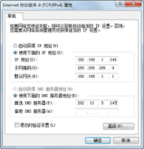

## 7.3  网络配置
 

&emsp;&emsp;知道了计算机网络的概念，了解了TCP/IP协议族之后，又学习了IP地址、子网掩码和域名。接下来会带着大家动手操作，实践如何配置和查看计算机网络相关的信息。

### 7.3.1  配置和查看  

&emsp;&emsp;根据Windows操作系统版本的不同，打开“Internet协议版本4（TCP/IPv4）属性”对话框的路径也可能不同，但普通用户一般都是通过打开该对话框来配置和查看IP地址等相关信息的，如图7.3所示。


<p align="center"></p>  
<p align="center">图7.3  配置和查看IP地址等相关信息</p>  


### 7.3.2  常用TCP/IP网络命令  

&emsp;&emsp;在实际使用网络的过程中，也常会使用命令行的方式来进行网络信息的配置和查看，这里介绍几个常用的命令。

- ipconfig

&emsp;&emsp;这是最常使用的一个检查网络配置的命令。Ipconfig命令显示当前所有的TCP/IP网络配置值、动态主机配置协议（DHCP）和域名系统（DNS）设置。使用不带参数的ipconfig命令可以显示所有适配器的IPv4地址或IPv6地址、子网掩码和默认网关。该命令的语法形式如下。


```
ipconfig [/all] [/renew [Adapter]] [/release [Adapter]] [/flushdns] [/displaydns] 
```


&emsp;&emsp;其中各参数的含义如下：

&emsp;&emsp;/all：显示所有适配器的完整TCP/IP配置信息。在没有该参数的情况下，ipconfig命令只显示各个适配器的IPv4地址或IPv6地址、子网掩码和默认网关值。适配器可以是物理接口（例如安装的网卡）或逻辑接口（例如拨号连接）。 

&emsp;&emsp;/renew [Adapter]：更新所有适配器或指定适配器的DHCP配置。该参数仅在具有配置为自动获取IP地址的适配器的计算机上可用，例如ipconfig /renew "Local Area Connection"。要获取适配器名称，可以先输入不带参数的ipconfig命令显示适配器的名称。

&emsp;&emsp;/release [Adapter]：释放所有适配器或指定适配器的当前DHCP配置，并丢弃IP地址配置。该参数可以禁用配置为自动获取IP地址的适配器。

&emsp;&emsp;/flushdns：刷新并重设DNS客户解析缓存的内容。在DNS故障排除期间，可以使用本参数重置DNS缓存内容。

&emsp;&emsp;/displaydns：显示DNS客户解析缓存的内容。包括本机hosts文件中的记录，以及由计算机解析名称过程中最近获得的任何资源记录。

- ping

&emsp;&emsp;ping命令通过发送Internet控制报文协议（ICMP）回响请求消息，来验证与另一台TCP/IP计算机的IP级连接。相应的回响应答消息的接收情况将和往返过程的时间一起显示出来。ping是用于检测网络连接性、可到达性和名称解析等疑难问题的主要 TCP/IP 命令。该命令的语法形式如下：


```
ping [-t] [-a] [-n Count] [-s Count] [-w Timeout] TargetName
```


&emsp;&emsp;其中各参数的含义为：

&emsp;&emsp;-t：指定在中断前ping命令可以向目的地持续不停地发送回响请求信息。要中断并显示统计信息，请按Ctrl+Break快捷键，要中断并退出ping命令，请按Ctrl+C快捷键。

&emsp;&emsp;-a：指定对目的地IP地址进行反向名称解析。如果解析成功，ping命令将显示相应的主机名，例如ping –a 192.168.1.149，解析成功的话会显示这台主机的主机名。

&emsp;&emsp;-n Count：指定发送回响请求消息的次数，默认值是4。

&emsp;&emsp;-w Timeout：指定等待回响应答消息响应的时间（以毫秒计），该回响应答消息响应接收到的指定回响请求消息。如果在超时时间内未接收到回响应答消息，将会显示请求超时的错误信息。默认的超时时间为4000（4秒），例如可以执行命令ping -n 10 -w 8000 192.168.1.149。

&emsp;&emsp;TargetName：指定目标主机的名称或 IP地址。


